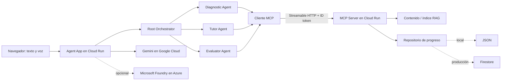
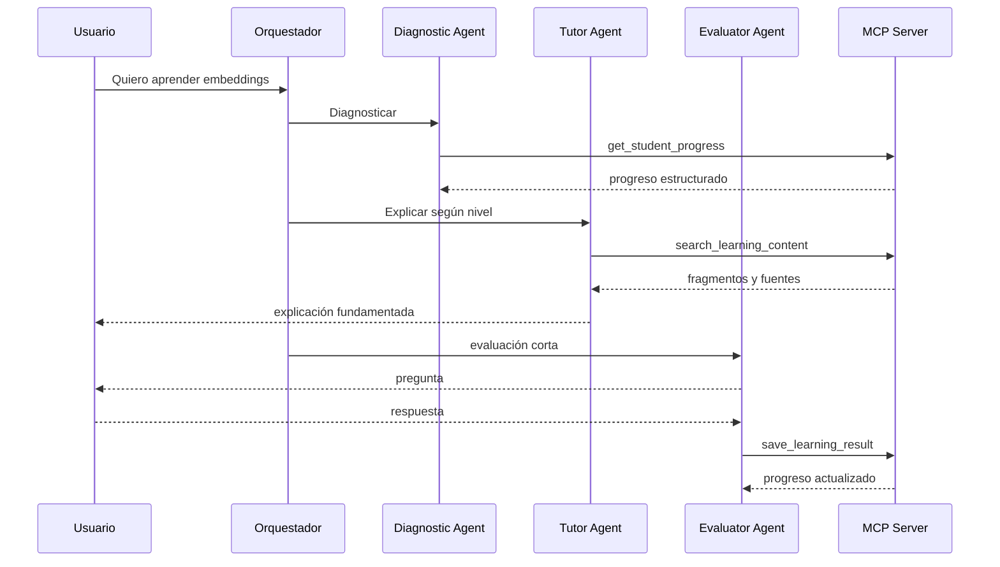

# Arquitectura

## Conceptos y fronteras

- **Modelo:** transforma entradas en salidas probabilísticas; Gemini será el
  predeterminado y Foundry será un proveedor opcional.
- **Agente:** combina modelo, instrucciones, estado y herramientas para decidir
  el siguiente paso hacia un objetivo.
- **Subagente:** agente especialista al que otro agente delega una
  responsabilidad con capacidad de decisión propia.
- **Herramienta:** operación acotada y validada, como buscar o guardar. No toma
  el rol de un agente.
- **MCP:** protocolo que estandariza cómo descubrir e invocar herramientas y
  leer recursos. El servidor MCP de este proyecto no es un agente.

## Componentes objetivo

La Fase 1 implementa la parte MCP, el índice local y el repositorio JSON. El
servidor se ejecuta como servicio remoto independiente mediante Streamable
HTTP sin estado y respuestas JSON.

## Secuencia objetivo de aprendizaje

La futura interfaz mostrará estos eventos resumidos, herramientas, duración y
resultado, pero nunca razonamiento interno ni chain-of-thought.

## Decisiones de Fase 1

1. **MCP SDK estable 1.x.** La línea 2.x está en alfa; se usa el límite `<2`
   para evitar una actualización incompatible.
2. **Streamable HTTP sin estado.** Es el transporte recomendado para servicios
   remotos y encaja con escalado horizontal en Cloud Run. La persistencia se
   mantiene fuera del proceso.
3. **RAG léxico local.** Un índice TF-IDF pequeño permite explicar y probar la
   recuperación sin credenciales, red ni costo. No pretende sustituir un índice
   vectorial de producción.
4. **Puerto de almacenamiento.** `ContentStore` separa recuperación de
   almacenamiento y `ProgressRepository` separa dominio de persistencia. En
   producción se agregarán adaptadores administrados sin cambiar herramientas.
5. **ADK como dependencia opcional.** ADK 2.x se incorporará al proceso del
   Agent App en Fase 2; no debe contaminar el servidor determinista MCP.
6. **Dos servicios Cloud Run.** El Agent App será público y el MCP privado. El
   primero invocará al segundo con una cuenta de servicio de mínimo privilegio
   y un ID token con la audiencia del servicio MCP.
7. **Multi-cloud explícito.** Si `MODEL_PROVIDER=foundry`, la aplicación sigue
   alojada en GCP y consume el modelo remotamente en Azure. La abstracción del
   proveedor evitará condicionales distribuidos.

## Decisiones de Fase 2

1. **Currículo como grafo acíclico ordenado.** `curriculum.py` es la fuente
   única de títulos, categorías, orden y prerrequisitos. La validación al
   importar exige que cada tema aparezca una vez y que sus dependencias estén
   antes en la ruta.
2. **Dominio mínimo de 80 puntos.** Un tema queda `completed` cuando alguna
   evaluación alcanza 80/100. Si existen intentos sin ese resultado queda
   `in_progress`; el mejor puntaje evita que un intento posterior reduzca un
   dominio ya demostrado.
3. **Prerrequisitos orientativos.** Un tema sin sus dependencias se muestra
   `blocked`, pero la API de chat continúa aceptándolo. La ruta guía al
   estudiante sin convertir el currículo en una barrera.
4. **Recomendación determinista y explicable.** Se priorizan temas en progreso
   y luego temas disponibles según el orden curricular. Cada recomendación
   incluye un motivo derivado de puntaje o prerrequisitos, sin razonamiento
   interno generado por un modelo.
5. **Compatibilidad del progreso.** `studied_topics` conserva su significado de
   temas evaluados. Los estados de fase 2 se derivan de las evaluaciones
   existentes.

## Decisiones de Fase 3

1. **Evaluaciones como fuente de verdad.** `topic_progress`, `studied_topics` y
   el nivel global se derivan del historial de `assessments`. El progreso por
   tema registra intentos, mejor puntaje, nivel, dominio y detalle por concepto
   sin crear una segunda fuente mutable.
2. **Nivel independiente por tema.** El mejor puntaje del tema determina su
   nivel: principiante por debajo de 60, intermedio desde 60 y avanzado desde
   85. El diagnóstico y la recuperación de contenido usan ese nivel específico,
   no el resumen global.
3. **Conceptos acumulativos.** Cada intento guarda conceptos acertados y
   pendientes. Un concepto queda dominado cuando aparece acertado al menos una
   vez; los intentos posteriores no eliminan dominio ya demostrado.
4. **Resumen global derivado.** El nivel global se calcula con el promedio de
   los mejores puntajes de los temas evaluados. Sirve como resumen de panel,
   pero no decide la profundidad de una explicación.
5. **Migración al leer.** Los campos nuevos tienen valores predeterminados. Al
   leer JSON o Firestore anteriores, los resúmenes por tema se reconstruyen de
   las evaluaciones históricas; el detalle por concepto comienza a poblarse con
   el siguiente intento. El primer guardado posterior persiste el formato nuevo.

## Reemplazos para producción

| Pieza local | Adaptador futuro | Motivo |
|---|---|---|
| `LocalProgressRepository` | `FirestoreProgressRepository` | concurrencia y durabilidad |
| `InMemoryContentStore` | índice administrado o vector store en GCP | volumen y búsqueda semántica |
| JSON curricular empaquetado | Google Cloud Storage + pipeline de ingestión | actualización independiente |

Firestore no debe ser llamado directamente desde agentes: seguirá detrás de
las herramientas MCP. El audio no se persistirá de forma predeterminada.
