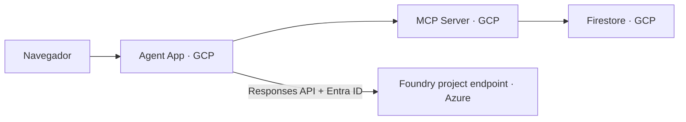

# Proveedor opcional Microsoft Foundry

## Qué cambia y qué no

Con `MODEL_PROVIDER=foundry`, **la aplicación, los agentes, la interfaz y MCP
siguen alojados en Google Cloud Run**. Sólo las solicitudes de generación del
`TutorAgent` se envían a un deployment de modelo en Microsoft Foundry (Azure).
Firestore continúa guardando progreso en GCP.



Esto implica transferencia de prompts y fragmentos curriculares entre nubes.
Antes de producción, revise residencia de datos, privacidad, egreso, latencia,
Private Link/VNet y las políticas de ambas organizaciones.

## API vigente elegida

El adaptador usa:

- endpoint de proyecto Foundry con forma
  `https://<recurso>.services.ai.azure.com/api/projects/<proyecto>`;
- ruta estable `/openai/v1/responses` mediante `AsyncOpenAI.responses.create`;
- `DefaultAzureCredential` y scope `https://ai.azure.com/.default`;
- nombre del deployment como `model`.

No usa el SDK beta `azure-ai-inference`, APIs “classic”, Assistants ni un agente
hospedado en Foundry. La decisión es intencional: este proyecto necesita cambiar
el **modelo** detrás de `ModelProvider`, no mover la orquestación fuera de GCP.

## Configuración local

Instale el grupo opcional:

```bash
python -m pip install -e ".[dev,agents,foundry]"
az login
```

Configure:

```dotenv
MODEL_PROVIDER=foundry
FOUNDRY_ENDPOINT=https://<recurso>.services.ai.azure.com/api/projects/<proyecto>
FOUNDRY_MODEL_DEPLOYMENT=<nombre-deployment>
FOUNDRY_SCOPE=https://ai.azure.com/.default
```

`DefaultAzureCredential` puede usar Azure CLI local. En Cloud Run, configure una
aplicación Entra mediante `AZURE_TENANT_ID`, `AZURE_CLIENT_ID` y
`AZURE_CLIENT_SECRET`, preferiblemente suministrados desde Secret Manager. No
registre esos valores.

La identidad necesita el rol de usuario/invocador de inferencia apropiado sobre
el proyecto o recurso Foundry, siguiendo mínimo privilegio. La asignación exacta
depende de la gobernanza del tenant y debe realizarla el administrador de Azure.

## Limitaciones de demo

- La voz continúa usando Gemini Live; `MODEL_PROVIDER=foundry` deshabilita el
  botón de voz para no mezclar proveedores silenciosamente.
- El adaptador adquiere un token Entra por generación y aplica timeout.
- Las pruebas usan clientes simulados y nunca llaman Azure.
- No se aprovisionan proyecto, deployment, roles ni red desde este repositorio.

