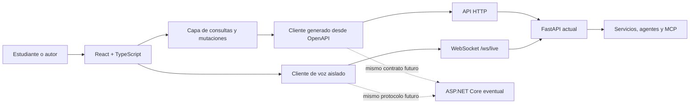

# Plan de migración del frontend a React

Estado: aprobado para ejecución por fases
Fecha de decisión: 11 de agosto de 2026
Alcance: reemplazar gradualmente la interfaz estática de `agent_app/static`
sin reescribir el backend ni interrumpir la aplicación vigente.

## Decisión

AITeacher adoptará un frontend independiente en `frontend/`, construido con
React, TypeScript y Vite. FastAPI continuará siendo la API, el servidor de voz
por WebSocket y el host de los recursos compilados durante esta migración.

No se incorporará Next.js. La aplicación no necesita SSR, React Server
Components ni un segundo runtime de servidor. La futura sustitución de
FastAPI por ASP.NET Core se tratará como otro proyecto y dependerá de preservar
los contratos HTTP y WebSocket, no de la tecnología usada por la interfaz.

La interfaz actual es la referencia de producto para capacidades, contenido,
accesibilidad y comportamiento. No es la referencia de arquitectura interna:
no se copiarán el estado global, la manipulación directa del DOM ni el archivo
monolítico de eventos.

## Por qué migrar ahora

La interfaz actual ya se comporta como una SPA completa:

- `agent_app/static/app.js` tiene aproximadamente 2,600 líneas y 93 KB.
- `index.html`, `styles.css` y `app.js` están cerca de los presupuestos de
  tamaño establecidos por las pruebas existentes.
- Un solo estado mutable coordina autenticación, catálogo, sesiones, tutor,
  evaluación, práctica, proyectos, autoría, observabilidad y voz.
- Las pruebas del frontend validan principalmente contratos de texto en los
  archivos, no interacciones reales de componentes.

El objetivo no es solamente cambiar la sintaxis a JSX. Es establecer límites
por dominio, contratos tipados, pruebas de comportamiento, accesibilidad
continua y carga selectiva de funcionalidades.

## Principios que no se negociarán

1. **Una capacidad por vez.** Cada fase ocupa una sesión independiente y no
   adelanta trabajo funcional de fases posteriores.
2. **Coexistencia antes del reemplazo.** La interfaz React vivirá inicialmente
   en `/app`; la interfaz vigente continuará en `/` hasta alcanzar paridad.
3. **Contratos antes que implementación.** React sólo conocerá una API tipada.
   Los componentes no dependerán de clases, repositorios ni detalles de
   FastAPI.
4. **Estado según su naturaleza.** No se creará un store global universal.
5. **Accesibilidad desde el primer componente.** WCAG 2.1 AA, teclado, foco,
   contraste, movimiento reducido y semántica forman parte de la definición de
   terminado de cada fase.
6. **Rendimiento por arquitectura.** Se evitarán cascadas de peticiones, se
   dividirá el bundle por rutas y se cargarán voz, autoría y observabilidad sólo
   cuando se utilicen.
7. **Diseño reconocible.** Se conservará la identidad oscura de AITeacher y se
   evolucionará mediante un sistema visual deliberado, no mediante una
   plantilla genérica de dashboard.
8. **La fuente de verdad permanece en el servidor.** El navegador sólo
   persistirá preferencias e identificadores mínimos, siempre versionados.
9. **Sin migración silenciosa.** Cada fase debe poder demostrarse, probarse y
   revertirse sin depender de la siguiente.

## Arquitectura objetivo



En producción se mantendrá inicialmente un solo origen y un solo contenedor
público. Esto conserva cookies, CSP, Google Identity y WebSocket sin introducir
CORS. Vite se usará como servidor de desarrollo y generador de recursos; no
será un servidor adicional en producción.

### Estructura prevista

```text
frontend/
├── src/
│   ├── app/                 # bootstrap, providers, router y límites de error
│   ├── api/                 # cliente, tipos OpenAPI y política de errores
│   ├── components/          # primitivas compartidas realmente reutilizables
│   ├── features/
│   │   ├── auth/
│   │   ├── authoring/
│   │   ├── catalog/
│   │   ├── observability/
│   │   ├── practice/
│   │   ├── projects/
│   │   ├── sessions/
│   │   ├── tutor/
│   │   └── voice/
│   ├── routes/              # ensamblaje de pantallas; sin lógica de dominio
│   ├── styles/              # tokens, reset y estilos globales mínimos
│   └── test/                # setup, MSW y utilidades de render
├── e2e/
├── public/
├── package.json
└── vite.config.ts
```

Cada componente complejo se colocará junto a sus pruebas, estilos y hook
específico. Se dividirá antes de superar aproximadamente 200 líneas o cuando
mezcle obtención de datos, presentación y coordinación de interacciones.

### Herramientas base

La fase R1 fijará versiones exactas y generará lockfile. La selección prevista
es:

- React + TypeScript en modo estricto.
- Vite para desarrollo, compilación y recursos con hash.
- React Router para rutas navegables y divisiones por pantalla.
- TanStack Query para estado remoto, deduplicación, caché, reintentos e
  invalidación.
- `openapi-typescript` y un cliente ligero basado en `fetch` para generar y
  consumir contratos sin duplicar modelos manualmente.
- React Compiler y las reglas actuales de hooks. El código seguirá siendo
  idiomático; no se añadirá memoización manual sin evidencia de perfilado.
- CSS Modules más propiedades personalizadas para reutilizar gradualmente la
  base visual existente sin introducir Tailwind ni reescribir todos los
  estilos.
- Vitest, Testing Library, MSW y axe para componentes e integración.
- Playwright para los recorridos críticos en navegador.

No se incorporarán Redux, Zustand, Storybook, una biblioteca visual completa o
un framework de formularios en R1. Sólo se añadirán cuando una fase demuestre
una necesidad concreta. Autoría podrá justificar React Hook Form y validación
de esquema en R8.

### Propiedad del estado

| Estado | Herramienta | Ejemplos |
|---|---|---|
| Remoto | TanStack Query | perfil, temas, proyectos, sesiones, progreso |
| Navegable | URL/search params | vista activa, búsqueda y filtros del catálogo |
| Local | `useState`/`useReducer` | formulario, drawer abierto, paso de una tarea |
| Transversal estable | Context pequeño | configuración del shell y sesión autenticada derivada |
| Frecuente y transitorio | `useRef` | buffers de audio, nodos, sockets y request IDs |
| Persistido mínimo | adaptador versionado | sesión activa y guía de voz descartada |

Los datos derivados se calcularán durante el render. No se sincronizarán copias
del estado remoto mediante efectos. Las consultas independientes se iniciarán
en paralelo y las mutaciones declararán explícitamente qué caché invalidan.

### Frontera de API y futura portabilidad a .NET

FastAPI ya publica OpenAPI a partir de sus modelos de respuesta. Se generará un
archivo de tipos dentro de `frontend/src/api/generated/` y se conservará en el
repositorio para que el build no dependa de ejecutar el backend. Una tarea
automatizada detectará divergencia entre el esquema y el cliente generado.

Las siguientes reglas protegen una futura migración a ASP.NET Core:

- Las rutas públicas se versionarán antes de cualquier cambio incompatible.
- Los errores tendrán una representación normalizada en la capa API.
- Cookies y autenticación serán detalles del transporte, no del árbol de
  componentes.
- La voz tendrá un protocolo documentado y tipos propios para mensajes y
  estados de conexión.
- Ningún componente importará modelos Python ni construirá supuestos sobre
  Firestore, MCP o el proveedor de modelos.

## Dirección visual

La base actual se preservará: fondo azul noche, superficies azul pizarra,
texto frío de alto contraste y acentos azul, verde y ámbar asociados a guía,
dominio y atención. Se convertirán los valores actuales en tokens semánticos
de superficie, contenido, borde, acción y estado.

Antes de escribir los componentes visuales de R1 se hará una exploración en dos
pasos:

1. Inventario del diseño vigente y propuesta compacta de color, tipografía,
   escala de espacio, radios y movimiento.
2. Crítica contra el producto real y eliminación de decisiones que parezcan un
   dashboard intercambiable.

La firma visual será la **ruta de aprendizaje viva**: la recomendación y el
avance deben sentirse como el hilo conductor entre catálogo, tutor y progreso.
La expresividad se concentrará allí; el resto de la interfaz será sobrio. No se
usarán gradientes decorativos, tarjetas uniformes o redondeo excesivo como
sustitutos de jerarquía.

El shell debe funcionar primero con las tipografías actuales. Cualquier fuente
nueva deberá ser autoalojada, justificar su costo de descarga y mejorar la
personalidad o legibilidad de forma visible.

## Niveles de madurez

| Nivel | Resultado | Fases |
|---|---|---|
| 1. Base moderna | React convive con la UI existente y entrega una vertical real | R1 |
| 2. Paridad por dominio | Las capacidades se trasladan sin cambiar contratos | R2–R8 |
| 3. Producción | Calidad, observabilidad y corte controlado | R9–R10 |
| 4. Consolidación | Se elimina la implementación heredada y queda una sola UI | R11 |

Las capacidades posteriores —internacionalización completa, PWA/offline,
streaming de texto, analítica de producto, experimentos o un backend .NET— no
forman parte de esta migración. La arquitectura quedará preparada para
incorporarlas como iniciativas independientes.

## Plan de sesiones

Para no confundirse con las ocho fases históricas del producto, esta migración
usa el prefijo `R`.

### R1 — Fundamento, convivencia y primera vertical

**Objetivo:** demostrar el recorrido completo de React sin reemplazar la UI
vigente.

**Entregables:**

- Crear `frontend/` con TypeScript estricto, Vite, React Compiler, lint, tests y
  lockfile.
- Crear el shell responsive, navegación y límites de error.
- Definir tokens semánticos a partir del CSS actual.
- Configurar proxy local para `/api` y `/ws`.
- Generar el cliente OpenAPI y una política uniforme de respuestas y errores.
- Servir el build en `/app` desde FastAPI y conservar `/` sin cambios.
- Migrar catálogo, filtros, recomendación y acción de iniciar un tema como la
  primera vertical funcional.
- Adaptar Docker a un build multi-stage sin incluir Node en la imagen final.

**Criterio de salida:** `/app` permite explorar temas reales en móvil y
escritorio; build, tipos, pruebas de catálogo y pruebas Python pasan; `/`
continúa funcionando.

**Fuera de alcance:** login de Google completo, historial, chat, voz, proyectos
y autoría.

### R2 — Proyectos integradores

**Objetivo:** migrar un dominio aislado con consulta, selección, formulario y
evaluación.

**Entregables:** catálogo de proyectos, workspace, entregables, rúbrica,
envío, resultado y estados de carga, vacío, error y reintento. La ruta se
cargará de forma diferida.

**Criterio de salida:** seleccionar y evaluar un proyecto produce el mismo
resultado que la UI vigente, con pruebas de teclado y navegación responsive.

### R3 — Identidad, autenticación y bootstrap

**Objetivo:** establecer una identidad única para todas las rutas React.

**Entregables:** consulta de capacidades y estado de autenticación en paralelo,
gate de Google, perfil, cierre de sesión, identidad invitada cuando corresponda
y carga diferida del script externo. No se guardarán tokens o PII en
`localStorage`.

**Criterio de salida:** modos con y sin autenticación funcionan, el foco queda
contenido y restaurado correctamente, y un `401` tiene recuperación uniforme.

### R4 — Sesiones y continuidad

**Objetivo:** recuperar y administrar conversaciones sin duplicar el estado del
servidor.

**Entregables:** listado, búsqueda, apertura, creación, renombrado, archivado y
eliminación; URL o identificador activo restaurable; caché e invalidaciones
documentadas; drawer accesible.

**Criterio de salida:** reiniciar o recargar conserva la continuidad, las
respuestas tardías no pisan una selección nueva y los flujos cuentan con
pruebas de integración.

### R5 — Tutor de texto

**Objetivo:** migrar el núcleo conversacional sin evaluación ni voz.

**Entregables:** composer, envío cancelable, feed, Markdown seguro, fuentes,
traza pública, estados de espera y recuperación. La lista de mensajes utilizará
renderizado eficiente y preservará el comportamiento de foco y scroll.

**Criterio de salida:** una conversación nueva y una restaurada producen la
misma secuencia visible que la UI vigente, sin XSS, dobles envíos ni respuestas
fuera de orden.

### R6 — Evaluación, práctica y progreso adaptativo

**Objetivo:** completar el ciclo pedagógico principal.

**Entregables:** pregunta pendiente, evaluación, rúbrica, feedback accionable,
ejercicios adaptativos, reanudación de práctica, progreso, dominio por tema y
acciones para otro ejemplo o explicación más simple.

**Criterio de salida:** el recorrido explicar → evaluar → practicar → continuar
es recuperable después de recargar y está cubierto por pruebas de estado y E2E.

### R7 — Voz en tiempo real

**Objetivo:** encapsular la funcionalidad de audio y WebSocket sin provocar
renders por cada muestra.

**Entregables:** máquina de estados de voz, hook de sesión, captura PCM,
AudioWorklet, reproducción, interrupción, mute, reconexión y fallback a texto.
La ruta y sus recursos se cargarán sólo al activar voz; buffers, analyser y
socket vivirán en referencias.

**Criterio de salida:** conectar, hablar, interrumpir, silenciar, cerrar y caer
a texto funcionan con limpieza completa de tracks, nodos y listeners.

### R8 — Autoría

**Objetivo:** migrar la superficie administrativa como una aplicación de
dominio separada.

**Entregables:** acceso protegido, listado y búsqueda, creación, edición,
validación, preview, publicación, despublicación, historial y reversión. El
editor se dividirá del navegador de lecciones y se cargará bajo demanda.

**Criterio de salida:** todos los estados editoriales tienen pruebas, contenido
inválido no puede publicarse y las acciones destructivas requieren confirmación
clara.

### R9 — Operación, accesibilidad y rendimiento

**Objetivo:** alcanzar o superar los contratos de calidad de la UI vigente.

**Entregables:** panel de observabilidad, salud, conexión offline/online,
anuncios, foco global, recuperación de errores, auditoría axe, recorridos
Playwright y presupuestos de bundle por ruta. Se medirán Web Vitals y perfiles
de render antes de añadir optimizaciones manuales.

**Criterio de salida:** cero hallazgos críticos o serios de accesibilidad, sin
errores de consola, pruebas en 320, 768, 1024 y 1440 px, y presupuestos de carga
aceptados y automatizados.

### R10 — Corte controlado

**Objetivo:** convertir React en la interfaz predeterminada con rollback
inmediato.

**Entregables:** React pasa a `/`; la UI vigente queda temporalmente en
`/legacy`; se actualizan CSP, caché, Docker, despliegue, smoke tests y
documentación operativa. Se ejecuta una matriz manual de paridad antes del
cambio.

**Criterio de salida:** el despliegue y rollback están documentados y probados,
las rutas profundas funcionan al recargar y los recorridos críticos pasan en el
build de producción.

### R11 — Retiro de la UI heredada

**Objetivo:** terminar la migración después de un periodo de estabilidad
acordado.

**Entregables:** retirar `index.html` y `app.js` heredados, eliminar estilos y
pruebas obsoletas, conservar sólo el AudioWorklet si la nueva implementación lo
usa, actualizar diagramas y cerrar presupuestos definitivos.

**Criterio de salida:** no existe código de ejecución duplicado, toda capacidad
está cubierta por React y la documentación declara una sola interfaz vigente.

## Definición de terminado por fase

Cada sesión debe entregar todo lo siguiente antes de marcar su fase completa:

- Alcance funcional demostrable y sin TODO imprescindibles.
- Typecheck, lint, pruebas unitarias/integración y build de producción verdes.
- Pruebas Python relevantes sin regresiones.
- Estados de carga, vacío, error, reintento y éxito cuando apliquen.
- Navegación completa con teclado, foco visible y nombres accesibles.
- Verificación visual en 320, 768, 1024 y 1440 px.
- Sin errores ni advertencias nuevas en la consola.
- Documentación y estado de esta hoja de ruta actualizados.
- Un breve handoff con decisiones, deuda deliberada y punto exacto de inicio de
  la siguiente fase.

Una fase no se considera terminada sólo porque compile. Si un criterio no puede
cumplirse, se registra como bloqueo y no se amplía silenciosamente el alcance.

## Protocolo para cada nueva sesión

El prompt de inicio recomendado es:

> Ejecuta la fase Rn del plan `docs/react-frontend-migration-plan.md`. Lee el
> estado y el handoff anterior, respeta estrictamente el alcance de esa fase,
> usa las skills `frontend-design`, `frontend-ui-engineering` y
> `vercel-react-best-practices`, implementa, verifica y actualiza el plan al
> finalizar.

Al comenzar una fase:

1. Leer este documento y el estado del repositorio.
2. Revisar cambios sin confirmar y no tocar trabajo ajeno.
3. Convertir sólo los entregables de la fase en un plan de ejecución.
4. Consultar reglas detalladas de las skills únicamente para los patrones que
   esa fase utilice.
5. Implementar y verificar antes de iniciar cualquier capacidad posterior.

## Estado de ejecución

| Fase | Estado | Handoff |
|---|---|---|
| R1 | Completada | Catálogo React en `/app`, contrato tipado y handoff al tutor heredado |
| R2 | Pendiente | Iniciar en la ruta diferida `/proyectos` sin ampliar auth, tutor o sesiones |
| R3 | Pendiente | — |
| R4 | Pendiente | — |
| R5 | Pendiente | — |
| R6 | Pendiente | — |
| R7 | Pendiente | — |
| R8 | Pendiente | — |
| R9 | Pendiente | — |
| R10 | Pendiente | — |
| R11 | Pendiente | — |

### Handoff de R1 — 11 de agosto de 2026

**Resultado.** `frontend/` queda creado con versiones exactas y lockfile,
TypeScript estricto, Vite 8, React 19, React Compiler, React Router, TanStack
Query, CSS Modules, ESLint, Vitest, Testing Library, MSW, axe y Playwright.
FastAPI sirve el build y rutas profundas en `/app`, conserva `/` sin cambios y
aplica caché inmutable sólo a los assets con hash. Docker construye React en
una etapa Node y la imagen final contiene únicamente Python y `dist`.

La primera vertical consulta `/api/topics` mediante un cliente generado desde
OpenAPI, presenta carga, vacío, error/reintento y éxito, mantiene búsqueda y
filtros en la URL, deriva la recomendación por materia y crea una sesión real
con `/api/chat`. El resultado se entrega a la UI vigente mediante
`/?session={id}#tutor`; ese puente es de convivencia y no migra chat ni estado
global al árbol React.

**Decisiones.** El catálogo se carga como chunk de ruta; TanStack Query posee
el estado remoto y no se usa memoización manual. La identidad anónima y la
sesión de handoff están detrás de un adaptador versionado. Los tokens conservan
el azul noche, pizarra y acentos semánticos actuales; se eliminan gradientes
decorativos y la expresividad queda concentrada en la ruta viva. Se usan
controles nativos y tipografía de sistema, sin biblioteca visual ni fuentes
externas.

**Deuda deliberada.** Google Identity y el bootstrap de perfil quedan para R3;
la UI React todavía entrega la sesión al tutor heredado hasta R4/R5. Los
presupuestos automáticos de bundle y Web Vitals se fijarán en R9. No se añade
una biblioteca de primitivas hasta que dialogs, menús o drawers demuestren la
necesidad. La suite Python heredada requiere vaciar `GOOGLE_CLIENT_ID` y
`APP_SESSION_SECRET` cuando el `.env` local activa auth, condición que ya
existía antes de R1.

**Inicio exacto de R2.** Crear `frontend/src/features/projects/` y una ruta
diferida `/proyectos` hija del `AppShell`; consumir primero `GET /api/projects`
con el cliente generado, y luego implementar selección, formulario y
`POST /api/projects/{project_id}/evaluate` con estados y pruebas. No modificar
catálogo, identidad, handoff, sesiones ni tutor al comenzar R2.

## Riesgos y respuestas

| Riesgo | Respuesta prevista |
|---|---|
| Reescritura demasiado grande | convivencia por ruta y una capacidad por fase |
| Dos UIs divergen | paridad explícita y ventana de convivencia limitada |
| Bundle mayor que la UI actual | división por rutas, imports directos y presupuestos por chunk |
| Estado React duplicado | TanStack Query como dueño del estado remoto |
| Regresiones de accesibilidad | Testing Library, axe, Playwright y QA de teclado por fase |
| Audio degrada el resto de la app | módulo diferido, referencias y limpieza exhaustiva |
| Contratos cambian sin aviso | cliente OpenAPI generado y prueba de drift |
| El build frontend complica Cloud Run | multi-stage; sólo `dist` llega a la imagen Python |
| Migración futura a .NET acopla la UI | capa API y protocolo WebSocket independientes del backend |

## Decisiones que se aplazan conscientemente

- La versión exacta de cada paquete se fijará en R1 usando versiones estables y
  compatibles en esa fecha.
- Una biblioteca de primitivas accesibles sólo se elegirá después de inventariar
  dialogs, menús y drawers existentes.
- La internacionalización se diseñará como iniciativa posterior; durante la
  migración se evitará dispersar copy nuevo innecesariamente.
- PWA, modo offline completo y notificaciones no pertenecen a la paridad.
- ASP.NET Core se evaluará cuando existan necesidades de dominio, identidad,
  integración empresarial o escala que FastAPI ya no cubra adecuadamente.
