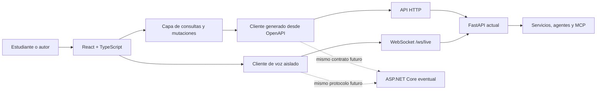

# Plan de migración del frontend a React

Estado: aprobado para ejecución por fases
Fecha de decisión: 11 de agosto de 2026
Alcance: reemplazar gradualmente la interfaz estática de `agent_app/static`
sin reescribir el backend ni interrumpir la aplicación vigente.

## Decisión

AITeacher adoptará un frontend independiente en `frontend/`, construido con
React, TypeScript y Vite. FastAPI continuará siendo la API, el servidor de voz
por WebSocket y el host de los recursos compilados durante esta migración.

No se incorporará Next.js. La aplicación no necesita SSR, React Server
Components ni un segundo runtime de servidor. La futura sustitución de
FastAPI por ASP.NET Core se tratará como otro proyecto y dependerá de preservar
los contratos HTTP y WebSocket, no de la tecnología usada por la interfaz.

La interfaz actual es la referencia de producto para capacidades, contenido,
accesibilidad y comportamiento. No es la referencia de arquitectura interna:
no se copiarán el estado global, la manipulación directa del DOM ni el archivo
monolítico de eventos.

## Por qué migrar ahora

La interfaz actual ya se comporta como una SPA completa:

- `agent_app/static/app.js` tiene aproximadamente 2,600 líneas y 93 KB.
- `index.html`, `styles.css` y `app.js` están cerca de los presupuestos de
  tamaño establecidos por las pruebas existentes.
- Un solo estado mutable coordina autenticación, catálogo, sesiones, tutor,
  evaluación, práctica, proyectos, autoría, observabilidad y voz.
- Las pruebas del frontend validan principalmente contratos de texto en los
  archivos, no interacciones reales de componentes.

El objetivo no es solamente cambiar la sintaxis a JSX. Es establecer límites
por dominio, contratos tipados, pruebas de comportamiento, accesibilidad
continua y carga selectiva de funcionalidades.

## Principios que no se negociarán

1. **Una capacidad por vez.** Cada fase ocupa una sesión independiente y no
   adelanta trabajo funcional de fases posteriores.
2. **Coexistencia antes del reemplazo.** La interfaz React vivirá inicialmente
   en `/app`; la interfaz vigente continuará en `/` hasta alcanzar paridad.
3. **Contratos antes que implementación.** React sólo conocerá una API tipada.
   Los componentes no dependerán de clases, repositorios ni detalles de
   FastAPI.
4. **Estado según su naturaleza.** No se creará un store global universal.
5. **Accesibilidad desde el primer componente.** WCAG 2.1 AA, teclado, foco,
   contraste, movimiento reducido y semántica forman parte de la definición de
   terminado de cada fase.
6. **Rendimiento por arquitectura.** Se evitarán cascadas de peticiones, se
   dividirá el bundle por rutas y se cargarán voz, autoría y observabilidad sólo
   cuando se utilicen.
7. **Diseño reconocible.** Se conservará la identidad oscura de AITeacher y se
   evolucionará mediante un sistema visual deliberado, no mediante una
   plantilla genérica de dashboard.
8. **La fuente de verdad permanece en el servidor.** El navegador sólo
   persistirá preferencias e identificadores mínimos, siempre versionados.
9. **Sin migración silenciosa.** Cada fase debe poder demostrarse, probarse y
   revertirse sin depender de la siguiente.

## Arquitectura objetivo



En producción se mantendrá inicialmente un solo origen y un solo contenedor
público. Esto conserva cookies, CSP, Google Identity y WebSocket sin introducir
CORS. Vite se usará como servidor de desarrollo y generador de recursos; no
será un servidor adicional en producción.

### Estructura prevista

```text
frontend/
├── src/
│   ├── app/                 # bootstrap, providers, router y límites de error
│   ├── api/                 # cliente, tipos OpenAPI y política de errores
│   ├── components/          # primitivas compartidas realmente reutilizables
│   ├── features/
│   │   ├── auth/
│   │   ├── authoring/
│   │   ├── catalog/
│   │   ├── observability/
│   │   ├── practice/
│   │   ├── projects/
│   │   ├── sessions/
│   │   ├── tutor/
│   │   └── voice/
│   ├── routes/              # ensamblaje de pantallas; sin lógica de dominio
│   ├── styles/              # tokens, reset y estilos globales mínimos
│   └── test/                # setup, MSW y utilidades de render
├── e2e/
├── public/
├── package.json
└── vite.config.ts
```

Cada componente complejo se colocará junto a sus pruebas, estilos y hook
específico. Se dividirá antes de superar aproximadamente 200 líneas o cuando
mezcle obtención de datos, presentación y coordinación de interacciones.

### Herramientas base

La fase R1 fijará versiones exactas y generará lockfile. La selección prevista
es:

- React + TypeScript en modo estricto.
- Vite para desarrollo, compilación y recursos con hash.
- React Router para rutas navegables y divisiones por pantalla.
- TanStack Query para estado remoto, deduplicación, caché, reintentos e
  invalidación.
- `openapi-typescript` y un cliente ligero basado en `fetch` para generar y
  consumir contratos sin duplicar modelos manualmente.
- React Compiler y las reglas actuales de hooks. El código seguirá siendo
  idiomático; no se añadirá memoización manual sin evidencia de perfilado.
- CSS Modules más propiedades personalizadas para reutilizar gradualmente la
  base visual existente sin introducir Tailwind ni reescribir todos los
  estilos.
- Vitest, Testing Library, MSW y axe para componentes e integración.
- Playwright para los recorridos críticos en navegador.

No se incorporarán Redux, Zustand, Storybook, una biblioteca visual completa o
un framework de formularios en R1. Sólo se añadirán cuando una fase demuestre
una necesidad concreta. Autoría podrá justificar React Hook Form y validación
de esquema en R8.

### Propiedad del estado

| Estado | Herramienta | Ejemplos |
|---|---|---|
| Remoto | TanStack Query | perfil, temas, proyectos, sesiones, progreso |
| Navegable | URL/search params | vista activa, búsqueda y filtros del catálogo |
| Local | `useState`/`useReducer` | formulario, drawer abierto, paso de una tarea |
| Transversal estable | Context pequeño | configuración del shell y sesión autenticada derivada |
| Frecuente y transitorio | `useRef` | buffers de audio, nodos, sockets y request IDs |
| Persistido mínimo | adaptador versionado | sesión activa y guía de voz descartada |

Los datos derivados se calcularán durante el render. No se sincronizarán copias
del estado remoto mediante efectos. Las consultas independientes se iniciarán
en paralelo y las mutaciones declararán explícitamente qué caché invalidan.

### Frontera de API y futura portabilidad a .NET

FastAPI ya publica OpenAPI a partir de sus modelos de respuesta. Se generará un
archivo de tipos dentro de `frontend/src/api/generated/` y se conservará en el
repositorio para que el build no dependa de ejecutar el backend. Una tarea
automatizada detectará divergencia entre el esquema y el cliente generado.

Las siguientes reglas protegen una futura migración a ASP.NET Core:

- Las rutas públicas se versionarán antes de cualquier cambio incompatible.
- Los errores tendrán una representación normalizada en la capa API.
- Cookies y autenticación serán detalles del transporte, no del árbol de
  componentes.
- La voz tendrá un protocolo documentado y tipos propios para mensajes y
  estados de conexión.
- Ningún componente importará modelos Python ni construirá supuestos sobre
  Firestore, MCP o el proveedor de modelos.

## Dirección visual

La base actual se preservará: fondo azul noche, superficies azul pizarra,
texto frío de alto contraste y acentos azul, verde y ámbar asociados a guía,
dominio y atención. Se convertirán los valores actuales en tokens semánticos
de superficie, contenido, borde, acción y estado.

Antes de escribir los componentes visuales de R1 se hará una exploración en dos
pasos:

1. Inventario del diseño vigente y propuesta compacta de color, tipografía,
   escala de espacio, radios y movimiento.
2. Crítica contra el producto real y eliminación de decisiones que parezcan un
   dashboard intercambiable.

La firma visual será la **ruta de aprendizaje viva**: la recomendación y el
avance deben sentirse como el hilo conductor entre catálogo, tutor y progreso.
La expresividad se concentrará allí; el resto de la interfaz será sobrio. No se
usarán gradientes decorativos, tarjetas uniformes o redondeo excesivo como
sustitutos de jerarquía.

El shell debe funcionar primero con las tipografías actuales. Cualquier fuente
nueva deberá ser autoalojada, justificar su costo de descarga y mejorar la
personalidad o legibilidad de forma visible.

## Niveles de madurez

| Nivel | Resultado | Fases |
|---|---|---|
| 1. Base moderna | React convive con la UI existente y entrega una vertical real | R1 |
| 2. Paridad por dominio | Las capacidades se trasladan sin cambiar contratos | R2–R8 |
| 3. Producción | Calidad, observabilidad y corte controlado | R9–R10 |
| 4. Consolidación | Se elimina la implementación heredada y queda una sola UI | R11 |

Las capacidades posteriores —internacionalización completa, PWA/offline,
streaming de texto, analítica de producto, experimentos o un backend .NET— no
forman parte de esta migración. La arquitectura quedará preparada para
incorporarlas como iniciativas independientes.

## Plan de sesiones

Para no confundirse con las ocho fases históricas del producto, esta migración
usa el prefijo `R`.

### R1 — Fundamento, convivencia y primera vertical

**Objetivo:** demostrar el recorrido completo de React sin reemplazar la UI
vigente.

**Entregables:**

- Crear `frontend/` con TypeScript estricto, Vite, React Compiler, lint, tests y
  lockfile.
- Crear el shell responsive, navegación y límites de error.
- Definir tokens semánticos a partir del CSS actual.
- Configurar proxy local para `/api` y `/ws`.
- Generar el cliente OpenAPI y una política uniforme de respuestas y errores.
- Servir el build en `/app` desde FastAPI y conservar `/` sin cambios.
- Migrar catálogo, filtros, recomendación y acción de iniciar un tema como la
  primera vertical funcional.
- Adaptar Docker a un build multi-stage sin incluir Node en la imagen final.

**Criterio de salida:** `/app` permite explorar temas reales en móvil y
escritorio; build, tipos, pruebas de catálogo y pruebas Python pasan; `/`
continúa funcionando.

**Fuera de alcance:** login de Google completo, historial, chat, voz, proyectos
y autoría.

### R2 — Proyectos integradores

**Objetivo:** migrar un dominio aislado con consulta, selección, formulario y
evaluación.

**Entregables:** catálogo de proyectos, workspace, entregables, rúbrica,
envío, resultado y estados de carga, vacío, error y reintento. La ruta se
cargará de forma diferida.

**Criterio de salida:** seleccionar y evaluar un proyecto produce el mismo
resultado que la UI vigente, con pruebas de teclado y navegación responsive.

### R3 — Identidad, autenticación y bootstrap

**Objetivo:** establecer una identidad única para todas las rutas React.

**Entregables:** consulta de capacidades y estado de autenticación en paralelo,
gate de Google, perfil, cierre de sesión, identidad invitada cuando corresponda
y carga diferida del script externo. No se guardarán tokens o PII en
`localStorage`.

**Criterio de salida:** modos con y sin autenticación funcionan, el foco queda
contenido y restaurado correctamente, y un `401` tiene recuperación uniforme.

### R4 — Sesiones y continuidad

**Objetivo:** recuperar y administrar conversaciones sin duplicar el estado del
servidor.

**Entregables:** listado, búsqueda, apertura, creación, renombrado, archivado y
eliminación; URL o identificador activo restaurable; caché e invalidaciones
documentadas; drawer accesible.

**Criterio de salida:** reiniciar o recargar conserva la continuidad, las
respuestas tardías no pisan una selección nueva y los flujos cuentan con
pruebas de integración.

### R5 — Tutor de texto

**Objetivo:** migrar el núcleo conversacional sin evaluación ni voz.

**Entregables:** composer, envío cancelable, feed, Markdown seguro, fuentes,
traza pública, estados de espera y recuperación. La lista de mensajes utilizará
renderizado eficiente y preservará el comportamiento de foco y scroll.

**Criterio de salida:** una conversación nueva y una restaurada producen la
misma secuencia visible que la UI vigente, sin XSS, dobles envíos ni respuestas
fuera de orden.

### R6 — Evaluación, práctica y progreso adaptativo

**Objetivo:** completar el ciclo pedagógico principal.

**Entregables:** pregunta pendiente, evaluación, rúbrica, feedback accionable,
ejercicios adaptativos, reanudación de práctica, progreso, dominio por tema y
acciones para otro ejemplo o explicación más simple.

**Criterio de salida:** el recorrido explicar → evaluar → practicar → continuar
es recuperable después de recargar y está cubierto por pruebas de estado y E2E.

### R7 — Voz en tiempo real

**Objetivo:** encapsular la funcionalidad de audio y WebSocket sin provocar
renders por cada muestra.

**Entregables:** máquina de estados de voz, hook de sesión, captura PCM,
AudioWorklet, reproducción, interrupción, mute, reconexión y fallback a texto.
La ruta y sus recursos se cargarán sólo al activar voz; buffers, analyser y
socket vivirán en referencias.

**Criterio de salida:** conectar, hablar, interrumpir, silenciar, cerrar y caer
a texto funcionan con limpieza completa de tracks, nodos y listeners.

### R8 — Autoría

**Objetivo:** migrar la superficie administrativa como una aplicación de
dominio separada.

**Entregables:** acceso protegido, listado y búsqueda, creación, edición,
validación, preview, publicación, despublicación, historial y reversión. El
editor se dividirá del navegador de lecciones y se cargará bajo demanda.

**Criterio de salida:** todos los estados editoriales tienen pruebas, contenido
inválido no puede publicarse y las acciones destructivas requieren confirmación
clara.

### R9 — Operación, accesibilidad y rendimiento

**Objetivo:** alcanzar o superar los contratos de calidad de la UI vigente.

**Entregables:** panel de observabilidad, salud, conexión offline/online,
anuncios, foco global, recuperación de errores, auditoría axe, recorridos
Playwright y presupuestos de bundle por ruta. Se medirán Web Vitals y perfiles
de render antes de añadir optimizaciones manuales.

**Criterio de salida:** cero hallazgos críticos o serios de accesibilidad, sin
errores de consola, pruebas en 320, 768, 1024 y 1440 px, y presupuestos de carga
aceptados y automatizados.

### R10 — Corte controlado

**Objetivo:** convertir React en la interfaz predeterminada con rollback
inmediato.

**Entregables:** React pasa a `/`; la UI vigente queda temporalmente en
`/legacy`; se actualizan CSP, caché, Docker, despliegue, smoke tests y
documentación operativa. Se ejecuta una matriz manual de paridad antes del
cambio.

**Criterio de salida:** el despliegue y rollback están documentados y probados,
las rutas profundas funcionan al recargar y los recorridos críticos pasan en el
build de producción.

### R11 — Retiro de la UI heredada

**Objetivo:** terminar la migración después de un periodo de estabilidad
acordado.

**Entregables:** retirar `index.html` y `app.js` heredados, eliminar estilos y
pruebas obsoletas, conservar sólo el AudioWorklet si la nueva implementación lo
usa, actualizar diagramas y cerrar presupuestos definitivos.

**Criterio de salida:** no existe código de ejecución duplicado, toda capacidad
está cubierta por React y la documentación declara una sola interfaz vigente.

## Definición de terminado por fase

Cada sesión debe entregar todo lo siguiente antes de marcar su fase completa:

- Alcance funcional demostrable y sin TODO imprescindibles.
- Typecheck, lint, pruebas unitarias/integración y build de producción verdes.
- Pruebas Python relevantes sin regresiones.
- Estados de carga, vacío, error, reintento y éxito cuando apliquen.
- Navegación completa con teclado, foco visible y nombres accesibles.
- Verificación visual en 320, 768, 1024 y 1440 px.
- Sin errores ni advertencias nuevas en la consola.
- Documentación y estado de esta hoja de ruta actualizados.
- Un breve handoff con decisiones, deuda deliberada y punto exacto de inicio de
  la siguiente fase.

Una fase no se considera terminada sólo porque compile. Si un criterio no puede
cumplirse, se registra como bloqueo y no se amplía silenciosamente el alcance.

## Protocolo para cada nueva sesión

El prompt de inicio recomendado es:

> Ejecuta la fase Rn del plan `docs/react-frontend-migration-plan.md`. Lee el
> estado y el handoff anterior, respeta estrictamente el alcance de esa fase,
> usa las skills `frontend-design`, `frontend-ui-engineering` y
> `vercel-react-best-practices`, implementa, verifica y actualiza el plan al
> finalizar.

Al comenzar una fase:

1. Leer este documento y el estado del repositorio.
2. Revisar cambios sin confirmar y no tocar trabajo ajeno.
3. Convertir sólo los entregables de la fase en un plan de ejecución.
4. Consultar reglas detalladas de las skills únicamente para los patrones que
   esa fase utilice.
5. Implementar y verificar antes de iniciar cualquier capacidad posterior.

## Estado de ejecución

| Fase | Estado | Handoff |
|---|---|---|
| R1 | Completada | Catálogo React en `/app`, contrato tipado y handoff al tutor heredado |
| R2 | Completada | Proyectos React en `/app/proyectos`, workspace accesible y evaluación por rúbrica |
| R3 | Completada | Identidad común, bootstrap paralelo, gate Google, perfil, logout y recuperación `401` |
| R4 | Completada | Drawer accesible, continuidad versionada y administración completa de sesiones |
| R5 | Completada | Tutor React en `/app/tutor`, Markdown seguro, envío cancelable y continuidad sin handoff heredado |
| R6 | Completada | Evaluación, rúbrica, práctica reanudable y dominio por tema dentro del tutor React |
| R7 | Completada | Voz diferida con WebSocket, AudioWorklet, interrupción, mute, reconexión y fallback a texto |
| R8 | Completada | Mesa editorial React protegida, versionada y diferida en `/app/autoria` |
| R9 | Completada | Observabilidad tipada, conectividad y anuncios globales, foco global entre rutas y presupuestos de bundle automatizados |
| R10 | Completada | React predeterminado en `/`, UI heredada temporalmente en `/legacy`, rollback inmediato por variable de entorno y smoke test post-despliegue |
| R11 | Completada | UI heredada retirada por completo; React es la única interfaz servida y documentada |

### Handoff de R1 — 11 de agosto de 2026

**Resultado.** `frontend/` queda creado con versiones exactas y lockfile,
TypeScript estricto, Vite 8, React 19, React Compiler, React Router, TanStack
Query, CSS Modules, ESLint, Vitest, Testing Library, MSW, axe y Playwright.
FastAPI sirve el build y rutas profundas en `/app`, conserva `/` sin cambios y
aplica caché inmutable sólo a los assets con hash. Docker construye React en
una etapa Node y la imagen final contiene únicamente Python y `dist`.

La primera vertical consulta `/api/topics` mediante un cliente generado desde
OpenAPI, presenta carga, vacío, error/reintento y éxito, mantiene búsqueda y
filtros en la URL, deriva la recomendación por materia y crea una sesión real
con `/api/chat`. El resultado se entrega a la UI vigente mediante
`/?session={id}#tutor`; ese puente es de convivencia y no migra chat ni estado
global al árbol React.

**Decisiones.** El catálogo se carga como chunk de ruta; TanStack Query posee
el estado remoto y no se usa memoización manual. La identidad anónima y la
sesión de handoff están detrás de un adaptador versionado. Los tokens conservan
el azul noche, pizarra y acentos semánticos actuales; se eliminan gradientes
decorativos y la expresividad queda concentrada en la ruta viva. Se usan
controles nativos y tipografía de sistema, sin biblioteca visual ni fuentes
externas.

**Deuda deliberada.** Google Identity y el bootstrap de perfil quedan para R3;
la UI React todavía entrega la sesión al tutor heredado hasta R4/R5. Los
presupuestos automáticos de bundle y Web Vitals se fijarán en R9. No se añade
una biblioteca de primitivas hasta que dialogs, menús o drawers demuestren la
necesidad. La suite Python heredada requiere vaciar `GOOGLE_CLIENT_ID` y
`APP_SESSION_SECRET` cuando el `.env` local activa auth, condición que ya
existía antes de R1.

**Inicio exacto de R2.** Crear `frontend/src/features/projects/` y una ruta
diferida `/proyectos` hija del `AppShell`; consumir primero `GET /api/projects`
con el cliente generado, y luego implementar selección, formulario y
`POST /api/projects/{project_id}/evaluate` con estados y pruebas. No modificar
catálogo, identidad, handoff, sesiones ni tutor al comenzar R2.

### Handoff de R2 — 12 de agosto de 2026

**Resultado entregado.** `/app/proyectos` queda como ruta diferida hija del
`AppShell`. Consulta el catálogo real, presenta carga, vacío, error/reintento y
éxito, permite seleccionar un proyecto, revisar reto, entregables y rúbrica,
enviar una propuesta y recibir el mismo puntaje, estado, feedback, modo y
criterios que devuelve la UI vigente. Un fallo de evaluación conserva el texto
para reintentar. El foco se mueve al workspace y al resultado, y vuelve al
botón de apertura al cerrar. La navegación de R1 fue ajustada para conservar
el shell sin overflow a 320 px.

También se corrigió una regresión directamente relacionada en
`test_practice_and_projects_are_available_without_losing_main_quiz`: ahora el
repositorio de sesiones de esa prueba usa `tmp_path` en vez del archivo
compartido `.data/sessions.json`, evitando fallos de reemplazo en Windows sin
cambiar producción.

**Verificaciones ejecutadas.** TypeScript estricto y ESLint sin advertencias;
11 pruebas Vitest; build Vite de producción con chunk independiente de
proyectos; contrato OpenAPI y tipos generados sin drift; 10 pruebas Playwright
para catálogo y proyectos, incluidos teclado, foco, axe, consola y responsive
en 320, 768, 1024 y 1440 px; y 20 pruebas Python relevantes de hosting React,
API, actividades y contratos de la UI heredada.

**Decisiones tomadas.** TanStack Query posee únicamente el catálogo remoto y
la mutación de evaluación; selección y propuesta son estado local. No se añadió
store global, biblioteca visual, formulario externo ni memoización manual. La
mesa de proyecto numerada concentra la jerarquía visual en la secuencia real
reto → entregables → rúbrica; reutiliza los tokens nocturnos de R1, controles
nativos, movimiento reducido y carga selectiva por ruta. Los imports son
directos y el formulario no duplica datos del servidor.

**Deuda deliberada.** La ruta reutiliza provisionalmente el adaptador de
identidad anónima creado en catálogo; R3 lo sustituirá por el bootstrap común.
El resultado de proyecto no se restaura al recargar porque el contrato actual
no persiste evaluaciones de proyecto. Presupuestos automáticos de bundle y Web
Vitals permanecen en R9. No se adelantaron autenticación, sesiones, tutor,
práctica, voz, autoría u observabilidad.

**Riesgos pendientes.** Hasta R3, una sesión con autenticación puede cambiar la
identidad resuelta por el servidor respecto del identificador anónimo enviado
por el formulario, aunque el backend conserva hoy la misma regla de resolución
que la UI heredada. La evaluación puede usar el fallback determinista si el
proveedor falla; la interfaz lo comunica, pero no ofrece historial porque no
existe endpoint para recuperarlo.

**Punto exacto para comenzar R3.** Crear `frontend/src/features/auth/` y una
capa de bootstrap común al `AppShell`; iniciar en paralelo `GET
/api/capabilities` y `GET /api/auth/status`, tipar los dos resultados con el
cliente generado y cubrir primero los modos autenticación deshabilitada,
invitado y `401`. Después integrar Google Identity de forma diferida, perfil y
cierre de sesión. No tocar todavía listado de sesiones, chat, voz ni proyectos
salvo para consumir la identidad común resultante.

### Handoff de R3 — 12 de agosto de 2026

**Resultado entregado.** El árbol React inicia `GET /api/capabilities` y
`GET /api/auth/status` en paralelo antes de montar rutas. Con auth deshabilitada
conserva una identidad invitada versionada; con auth habilitada presenta un
gate modal que contiene y restaura el foco, carga Google Identity Services sólo
cuando hace falta, intercambia la credencial por una cookie HttpOnly y muestra
el perfil mínimo en el shell. El cierre de sesión vuelve al gate y cualquier
respuesta `401` del cliente generado activa la misma recuperación uniforme.
Catálogo y proyectos reciben el `studentId` común y no guardan tokens ni PII en
`localStorage`. El contrato de capacidades ahora usa `AppCapabilities` como
modelo OpenAPI en vez de un diccionario sin tipo.

**Verificaciones ejecutadas.** TypeScript estricto y ESLint sin advertencias;
16 pruebas Vitest para concurrencia del bootstrap, modos deshabilitado y
autenticado, login, PII, perfil, logout, `401`, foco, error/reintento y axe;
build Vite de producción con `googleIdentity` en un chunk diferido de 0.94 kB;
OpenAPI y tipos sin drift; 16 recorridos Playwright completados para catálogo,
proyectos y auth, con teclado, foco, axe, consola y responsive en 320, 768,
1024 y 1440 px; inspección visual manual en escritorio y 320 px sin overflow;
10 pruebas Python de auth/hosting y 14 de API y contratos heredados. En este
host se ejecutó Playwright contra Vite ya levantado para aislar el ciclo de vida
del servidor: 16/16 casos pasaron con código de salida limpio.

**Decisiones tomadas.** TanStack Query posee capacidades, estado de auth y
perfil; un contexto pequeño expone identidad resuelta, capacidades y logout.
Un único suscriptor del cliente normaliza `401`; no se añadió store global ni
dependencia de auth. GIS usa import dinámico, una inicialización por client ID
y callback vigente para respetar StrictMode sin advertencias. La caché de temas
se elimina sólo cuando cambia la identidad; reautenticar el mismo perfil
conserva el árbol y permite restaurar foco. Visualmente, el gate es un umbral
sobrio que reutiliza la línea semántica guía → dominio → atención sin competir
con la ruta viva.

**Deuda deliberada.** Capacidades ya se consultan, pero voz y autoría
permanecen ocultas hasta R7 y R8. El menú de cuenta no incorpora sesiones: el
drawer, búsqueda y continuidad pertenecen a R4. Presupuestos de bundle y Web
Vitals siguen en R9. El adaptador invitado conserva las claves heredadas
durante convivencia; su limpieza corresponde al retiro de la UI antigua.

**Riesgos pendientes.** Google Identity depende del script externo y su
iframe; el gate ofrece error/reintento, pero una política corporativa que lo
bloquee impide continuar cuando auth es obligatoria. El perfil se recupera del
servidor tras recargar y nunca se persiste localmente, por lo que un backend no
disponible bloquea correctamente el bootstrap. El runner de este host no cerró
Vite cuando lo creó como hijo; usar un servidor preexistente produjo una salida
limpia, por lo que conviene vigilar el ciclo de vida del web server en CI.

**Punto exacto para comenzar R4.** Crear
`frontend/src/features/sessions/` y tipar primero `GET /api/sessions` usando el
`studentId` de `useAppSession`; añadir una ruta o drawer accesible para listado,
búsqueda y apertura, restaurando la sesión activa desde el adaptador versionado
existente. Después implementar crear, renombrar, archivar, restaurar y eliminar
con invalidaciones explícitas y protección contra respuestas tardías. No tocar
todavía feed, composer, Markdown, evaluación, práctica ni voz.

### Handoff de R4 — 12 de agosto de 2026

**Resultado entregado.** El `AppShell` incorpora una bitácora de conversaciones
como drawer modal accesible. Consulta `GET /api/sessions` con la identidad de
`useAppSession`, separa activas y archivadas, busca por título o tema y cubre
carga, vacío, sin coincidencias, error/reintento y éxito. Permite iniciar una
conversación limpia, abrir, renombrar, archivar, restaurar y eliminar con una
confirmación explícita. Abrir recupera primero el detalle tipado y sólo después
entrega la sesión al tutor heredado; React aún no representa mensajes ni
composer.

La sesión activa se restaura tras recargar mediante un adaptador mínimo
versionado compatible con la clave heredada. Una sesión ausente o archivada
invalida esa continuidad. Cada apertura recibe un request ID y las respuestas
tardías no pueden reemplazar la selección vigente ni disparar un handoff. El
drawer contiene el foco, cierra con Escape o scrim, restaura el control de
origen y mueve el foco al contenido principal al comenzar de cero.

**Verificaciones ejecutadas.** Se confirmó primero R3 con typecheck, lint, 16
Vitest, build, OpenAPI, 16 Playwright y 10 pruebas Python de auth/hosting. Para
R4 pasaron TypeScript estricto y ESLint sin advertencias; 21 pruebas Vitest;
build Vite de producción; esquema OpenAPI y tipos sin drift; 22 pruebas
Playwright de catálogo, proyectos, auth y sesiones con teclado, foco, axe,
consola, recarga y responsive en 320, 768, 1024 y 1440 px; y 25 pruebas Python
de repositorios local/Firestore, API de sesiones, auth, hosting, accesibilidad y
rendimiento heredados. También se inspeccionó visualmente el gate móvil del
host local; el drawer se revisó en navegador con fixtures deterministas porque
el entorno local exige Google auth.

**Decisiones tomadas.** TanStack Query es el único dueño de listado y detalles;
las mutaciones actualizan el detalle conocido e invalidan explícitamente el
listado. El contexto expone datos y estados primitivos en vez del objeto
completo de `useQuery`, evitando snapshots obsoletos bajo React Compiler. La
búsqueda, conteos y selección visible se derivan durante render; no hay store
global ni memoización manual. El adaptador persiste sólo `studentId` y
`sessionId`, ambos versionados y protegidos ante almacenamiento no disponible.
Las acciones son controles nativos visibles, sin biblioteca de menús ni
dialogs. Visualmente, la bitácora compacta usa fecha, tema y actividad; una
única línea guía señala la conversación activa. En 320 px ocupa todo el ancho
y el header cede la marca antes que navegación, sesiones o cuenta.

**Deuda deliberada.** El feed, Markdown, fuentes, composer y envío cancelable
pertenecen a R5; por eso abrir continúa entregando a `/?session={id}#tutor` y
“Nueva conversación” vuelve al catálogo sin crear un registro vacío. El
backend no ofrece endpoint de creación independiente: la sesión nace con el
primer `POST /api/chat`. El listado se solicita con archivadas incluidas para
administrarlas en un solo drawer; paginación o búsqueda de servidor requieren
un contrato futuro y no se simulan en cliente. Los presupuestos automáticos de
bundle y Web Vitals siguen en R9.

**Riesgos pendientes.** Un estudiante con muchas conversaciones recibe hoy el
listado completo conforme al contrato actual y la retención configurada. El
handoff mantiene una navegación completa a la UI heredada hasta R5, aunque el
identificador versionado evita perder continuidad. Si dos mutaciones sobre la
misma conversación se envían simultáneamente, prevalece el orden del servidor;
la interfaz deshabilita las acciones del elemento durante cada operación, pero
no implementa control de versión porque el API no expone uno.

**Punto exacto para comenzar R5.** Crear
`frontend/src/features/tutor/` y una ruta diferida `/tutor` dentro del
`AppShell`. Consumir primero el identificador activo y
`sessionDetailOptions(studentId, sessionId)` ya existentes para representar el
feed restaurado con Markdown seguro, fuentes y traza pública. Después añadir el
composer y `POST /api/chat` cancelable, usando el mismo `session_id` y
actualizando/invalidando las claves de sesiones. Sustituir el handoff
heredado sólo cuando conversación nueva y restaurada tengan paridad. No tocar
todavía evaluación, práctica, voz u observabilidad.

### Handoff de R5 — 13 de agosto de 2026

**Resultado entregado.** `/app/tutor` queda como ruta diferida hija del
`AppShell` y sustituye el handoff al tutor heredado tanto al iniciar un tema
como al abrir o crear una conversación desde la bitácora. Una sesión restaurada
se representa desde `ConversationDetail`; una sesión nueva conserva la
secuencia usuario → tutor mientras el detalle persistido se sincroniza. El feed
incluye Markdown GFM seguro sin HTML crudo, enlaces externos limitados a HTTP y
HTTPS, fuentes, notas y la traza pública de la respuesta vigente con una
aclaración explícita de que no muestra razonamiento interno.

El composer valida el contrato de 2 a 4,000 caracteres, admite Ctrl/⌘ + Enter,
impide envíos simultáneos, ofrece cancelación visible y restaura el borrador al
cancelar o fallar. `AbortController`, request IDs y seguimiento del scroll viven
en referencias; una respuesta tardía no puede sustituir la vigente. El foco se
mueve al título al entrar o cambiar de conversación y vuelve al editor después
de responder. El historial sigue la cola sólo cuando el estudiante está cerca
del final, usa `content-visibility` para conversaciones largas y expone un
control de teclado para llegar al mensaje más reciente.

**Verificaciones ejecutadas.** Antes de modificar se reconfirmó R4 con
TypeScript, ESLint, 21 Vitest, build, OpenAPI sin drift, 25 pruebas Python y 22
recorridos Playwright; todos los casos pasaron y el wrapper volvió a agotar el
timeout únicamente por el ciclo de vida conocido de Vite. Para R5 pasaron
TypeScript estricto, ESLint sin advertencias, 26 pruebas Vitest, build Vite de
producción, OpenAPI y tipos sin drift, 25 pruebas Python relevantes y 27
recorridos Playwright contra un Vite controlado. Los E2E cubren XSS, Markdown,
fuentes, traza, foco, teclado, envío único, continuidad, respuestas tardías,
consola, axe y 320, 768, 1024 y 1440 px. La inspección visual adicional en el
navegador confirmó cero overflow y consola limpia en los cuatro anchos. El
build conserva un chunk independiente de tutor de 168.19 kB (51.37 kB gzip).

**Decisiones tomadas.** TanStack Query continúa como dueño de listados y
detalles; el intercambio todavía no reflejado por el GET es un estado local
efímero y desaparece al reconocer el par persistido. La activación de una
sesión recién creada tolera sólo el snapshot anterior del listado y vuelve a
validarse al recibir una versión nueva. `react-markdown@10.1.0` y
`remark-gfm@4.0.1` se fijaron en el lockfile; no se usa
`dangerouslySetInnerHTML`, HTML embebido ni carga de imágenes remotas. La traza
permanece local porque el contrato de sesiones no la persiste. No se añadió
store global, memoización manual, biblioteca visual ni virtualizador: CSS
`content-visibility` es suficiente para el contrato actual.

**Deuda deliberada.** Pregunta pendiente, evaluación, rúbrica, práctica,
progreso y acciones pedagógicas pertenecen a R6 y no se representaron en R5.
Voz, autoría y observabilidad permanecen en R7, R8 y R9. Fuentes sigue siendo
una lista de referencias textuales porque el API no entrega metadatos ni URL
tipada. La persistencia histórica de la traza requeriría ampliar el contrato y
no se simula en cliente. Presupuestos automáticos del chunk Markdown, Web
Vitals y perfilado de render siguen en R9.

**Riesgos pendientes.** `ConversationDetail` todavía entrega el historial
completo y no existe paginación de mensajes. Abortar `fetch` detiene la espera
del navegador, pero el contrato de `POST /api/chat` no ofrece clave de
idempotencia: si el servidor ya aceptó la petición puede terminarla después de
la cancelación; la próxima sincronización recuperará ese resultado, pero un
reenvío manual inmediato podría repetir el texto. El cliente sí bloquea dobles
submits y descarta respuestas fuera de orden. El runner sólo cierra limpiamente
cuando Playwright reutiliza un Vite administrado por separado; el `webServer`
que crea Playwright sigue pudiendo dejar vivo el proceso hijo en este host.

**Punto exacto para comenzar R6.** Crear
`frontend/src/features/evaluation/` y consumir primero
`pending_quiz` del `ConversationDetail` activo dentro de `/tutor`; implementar
`POST /api/evaluate`, rúbrica, feedback y recuperación tras recarga usando las
claves de sesión existentes. Después crear `frontend/src/features/practice/`
para inicio, evaluación y reanudación de práctica, y finalmente refrescar
progreso y dominio por tema. No tocar voz, autoría, observabilidad ni el corte
de rutas al comenzar R6.

### Handoff de R6 — 14 de agosto de 2026

**Resultado entregado.** `/app/tutor` completa el ciclo pedagógico principal.
La conversación activa representa `pending_quiz`, valida y envía la respuesta
a `POST /api/evaluate`, conserva el borrador ante error y presenta puntuación,
estado, feedback accionable, fortalezas, mejoras y las cuatro dimensiones de la
rúbrica. El resultado mueve el foco a su título y ofrece continuar con la
siguiente pregunta, pedir otro ejemplo, solicitar una explicación más simple o
practicar todos los conceptos pendientes o uno específico.

La práctica adaptativa usa `POST /api/practice/start` y
`POST /api/practice/evaluate`, comunica dificultad, ronda, conceptos, consigna
y pista, preserva la respuesta al fallar y permite avanzar al siguiente
ejercicio o volver a la pregunta principal. `pending_practice` se recupera del
detalle persistido: recargar y reabrir la conversación expone “Reanudar
práctica” en la ronda exacta. Un riel lateral consulta el catálogo mediante la
caché compartida y muestra progreso global, nivel, intentos, mejor puntaje y
conceptos dominados o pendientes por tema. La estación pregunta → rúbrica →
práctica concentra la ruta de aprendizaje viva sin convertir el tutor en una
cuadrícula genérica.

**Verificaciones ejecutadas.** Antes de modificar se reconfirmó R5 con
TypeScript, ESLint, 26 Vitest, build, OpenAPI sin drift, 21 pruebas Python de
los modos invitado y autenticado y 27 Playwright; el primer intento Python
recibió `401` porque el `.env` local define `GOOGLE_CLIENT_ID`, y la repetición
aislada del modo invitado pasó sin cambiar código. Para R6 pasaron TypeScript
estricto, ESLint sin advertencias, 29 pruebas Vitest, build Vite de producción,
esquema OpenAPI y tipos sin drift, 93 pruebas Python relevantes de API,
orquestación, evaluación híbrida, progreso, sesiones, accesibilidad y
rendimiento heredado, y 28 recorridos Playwright. Los E2E cubren teclado, foco,
error/reintento, rúbrica, práctica dirigida, siguiente ejercicio, recarga,
reanudación, consola limpia, axe sin hallazgos críticos o serios y ausencia de
overflow en 320, 768, 1024 y 1440 px. El chunk diferido del tutor queda en
194.00 kB, 59.42 kB gzip.

**Decisiones tomadas.** TanStack Query sigue siendo el único dueño de catálogo
y detalles de sesión; las respuestas vigentes de evaluación y práctica son
estado local efímero y las tres invalidaciones independientes —listado,
detalle y catálogo— se ejecutan en paralelo. La pregunta y el ejercicio
restaurables proceden exclusivamente de `ConversationDetail`; no se creó un
store global ni una copia persistida en el navegador. Los envíos de chat,
evaluación y práctica se excluyen mutuamente, abortan al desmontar y bloquean
dobles submits. `TutorScreen` quedó dividido en presentación y hooks enfocados,
con imports directos, valores derivados durante render y sin memoización
manual. La UI conserva tokens, tipografía, radios, foco y movimiento reducido
de las fases anteriores; la rúbrica usa controles nativos `meter` y el progreso
usa `progress` con nombres accesibles.

**Deuda deliberada.** El servidor persiste los mensajes, la siguiente pregunta
y el siguiente ejercicio, pero `ConversationDetail` no conserva el último
objeto estructurado de rúbrica o resultado de práctica. Por eso una recarga
restaura el feedback narrativo en el feed y el punto exacto para continuar,
pero no reconstruye la visualización enriquecida del intento anterior. No se
inventó almacenamiento cliente ni se amplió el contrato backend dentro de esta
fase. Paginación del historial, virtualización medida, presupuestos automáticos
de bundle y Web Vitals continúan en R9. Voz, autoría, observabilidad y el corte
de rutas permanecen en R7–R10.

**Riesgos pendientes.** `POST /api/evaluate` y los endpoints de práctica no
ofrecen clave de idempotencia: la interfaz impide envíos simultáneos, pero una
pérdida de red después de que el servidor acepte la respuesta puede hacer que
un reintento manual cuente otro intento. El detalle de conversación sigue
entregando el historial completo. El chunk del tutor creció por la vertical de
R6 y debe vigilarse cuando R7 incorpore audio; voz tendrá que permanecer en un
chunk independiente y cargarse sólo al activarla. El runner Playwright de este
host continúa necesitando un Vite administrado por separado para cerrar con
código limpio; con ese modo los 28 casos terminaron correctamente.

**Punto exacto para comenzar R7.** Crear `frontend/src/features/voice/` y tipar
primero el protocolo público de `/ws/live` junto con una máquina explícita de
estados desconectado → conectando → escuchando → respondiendo → error. Añadir
el control de activación al tutor sólo cuando `capabilities.voice` sea
verdadero, mediante import dinámico que deje WebSocket, AudioWorklet, captura y
reproducción fuera del chunk actual. Después implementar interrupción, mute,
reconexión, fallback a texto y limpieza completa, manteniendo socket, buffers,
analyser, nodos y tracks en referencias. No tocar autoría, observabilidad,
presupuestos globales ni rutas predeterminadas al comenzar R7.

### Handoff de R7 — 14 de agosto de 2026

**Resultado entregado.** El tutor muestra “Conversar por voz” únicamente cuando
`capabilities.voice` está habilitado. El primer clic importa de forma dinámica
un módulo aislado que abre un diálogo modal accesible y conecta `/ws/live` con
la identidad y conversación activas. La sesión captura PCM mono mediante el
AudioWorklet existente, reduce a 16 kHz/16 bits, reproduce PCM de 24 kHz y
representa el protocolo público con una máquina explícita desconectado →
conectando → escuchando → respondiendo → error. Transcripción reciente, mute
real de tracks, interrupción inmediata de reproducción, reconexión explícita,
finalización y fallback al composer funcionan sin perder el contexto textual.

El cierre, error, fallback, cambio de montaje y repetición de StrictMode limpian
tracks, socket, listeners, `MessagePort`, contexto, nodos, analyser y fuentes de
reproducción. El diálogo contiene el foco, cierra con Escape, restaura el botón
de origen o lleva el foco al editor al caer a texto, vuelve inerte el árbol de
la aplicación y respeta movimiento reducido. Vite proxifica `/static` para que
el AudioWorklet servido por FastAPI también funcione en desarrollo.

**Verificaciones ejecutadas.** Antes de modificar se confirmó R6 con
TypeScript, ESLint, 29 Vitest, build, OpenAPI sin drift, 100 pruebas Python
relevantes en modo invitado aislado del `.env` local y 28 Playwright. Para R7
pasaron TypeScript estricto y ESLint sin advertencias; 32 pruebas Vitest;
build Vite de producción; esquema OpenAPI y tipos sin drift; 105 pruebas Python
relevantes, incluidas las cinco del puente/configuración de voz; y 33 recorridos
Playwright. Los E2E prueban que el módulo no se solicita antes de activarlo,
permiso y captura, URL del socket, AudioWorklet, transcripción, reproducción,
mute, interrupción, desconexión, reconexión, limpieza, Escape/foco, fallback y
consola limpia. Axe no reportó hallazgos críticos o serios y no hubo overflow
en 320, 768, 1024 o 1440 px. Voz queda en un chunk independiente de 13.68 kB
(5.27 kB gzip) más 6.07 kB de CSS (1.76 kB gzip); el chunk del tutor queda en
192.26 kB (58.51 kB gzip).

**Decisiones tomadas.** La activación usa `import()` desde el evento del botón,
no una ruta o `lazy` que descargue voz al renderizar. Un reducer posee sólo los
hitos visibles; una referencia de fase evita despachar por cada bloque PCM.
Socket, stream, contexto, analyser, nodos, fuentes, cursor de reproducción y
generaciones de conexión viven en referencias agrupadas en un runtime sin
estado global. Las respuestas tardías se descartan por generación y una
reconexión adquiere recursos nuevos después de limpiar los anteriores. Se
reutilizó el AudioWorklet público del backend y no se duplicó en el bundle. La
señal visual azul/verde concentra el gesto expresivo de la ruta de aprendizaje;
el resto conserva tokens y jerarquía del tutor.

**Deuda deliberada.** La transcripción de voz es efímera porque `/ws/live` no
la incorpora al historial HTTP ni confirma progreso; no se inventó persistencia
en el navegador. La reconexión requiere una acción explícita y no añade backoff
automático. Navegadores sin AudioWorklet caen al chat en vez de usar el API
obsoleto `ScriptProcessor`. La prueba automatizada usa dispositivos, Audio API
y WebSocket deterministas; una sesión real con hardware y Gemini Live requiere
credenciales y pertenece al smoke del entorno desplegado. Autoría,
observabilidad, presupuestos globales y corte de rutas continúan en R8–R10.

**Riesgos pendientes.** La disponibilidad final depende de permiso de
micrófono, políticas del navegador, conectividad WebSocket y Gemini Live. El
botón de interrupción detiene el audio local de inmediato y el micrófono sigue
abierto; la cancelación del turno del modelo depende de que el proveedor
detecte la nueva voz, igual que el protocolo heredado. El endpoint no persiste
audio ni transcripciones, por lo que una desconexión no puede reconstruir el
último turno hablado. El AudioWorklet continúa servido desde `/static` y debe
conservarse hasta R11.

**Punto exacto para comenzar R8.** Crear
`frontend/src/features/authoring/` y una ruta diferida `/app/autoria` visible
sólo cuando `capabilities.authoring` sea verdadera. Implementar primero un gate
de acceso que mantenga `x-authoring-token` sólo en memoria y tipar el listado de
`GET /api/authoring/lessons`; cubrir carga, vacío, error/reintento y búsqueda.
Después separar navegador y editor para creación, edición, validación, preview,
publicación, despublicación, historial y reversión. No modificar voz ni iniciar
observabilidad, presupuestos globales o el corte de rutas durante R8.

### Handoff de R8 — 14 de agosto de 2026

**Resultado entregado.** `/app/autoria` queda como ruta diferida y sólo aparece
en la navegación cuando `capabilities.authoring` está habilitada; una entrada
profunda sin esa capacidad vuelve al catálogo. El gate valida nombre y
credencial contra `GET /api/authoring/lessons`, mantiene
`x-authoring-token` únicamente en memoria y lo elimina al cerrar o abandonar
la ruta. Credenciales inválidas, carga, error/reintento, lista vacía, búsqueda
y selección tienen estados explícitos.

La mesa editorial separa un archivo de lecciones del editor cargado bajo
demanda. Permite crear y editar borradores tipados, valida identificador,
tema, nivel, longitud, fuente y palabras clave antes de enviar, previsualiza
Markdown seguro, publica —guardando primero cuando hay cambios—, despublica,
representa el historial completo y revierte cualquier versión anterior. La
despublicación y la reversión requieren confirmación en dos pasos, enfocan la
decisión principal y restauran el control de origen al cancelar. Publicar,
despublicar o revertir refresca el catálogo del estudiante para no conservar
contenido público obsoleto.

**Verificaciones ejecutadas.** Antes de modificar se reconfirmó R7 con
TypeScript, ESLint, 32 Vitest, OpenAPI sin drift, build, 141 pruebas Python
relevantes y 33 Playwright; voz conservó conexión, mute, interrupción,
reconexión, limpieza, fallback, axe y responsive. Para R8 pasaron TypeScript
estricto y ESLint sin advertencias; 36 pruebas Vitest; esquema OpenAPI y tipos
sin drift; build Vite de producción; 141 pruebas Python de unidad y de API,
auth y hosting; y 39 recorridos Playwright. Los seis casos nuevos cubren gate,
capacidad deshabilitada, carga diferida, búsqueda, validación, preview, ciclo
crear → publicar → despublicar → revertir, confirmación, foco, teclado,
credencial no persistida, consola limpia, axe sin hallazgos críticos o serios
y ausencia de overflow en 320, 768, 1024 y 1440 px. La revisión visual
adicional en 320 y 1440 px confirmó la jerarquía y el apilado. El build deja
`AuthoringRoute` en 14.89 kB (5.45 kB gzip), `LessonEditor` en 15.27 kB
(6.10 kB gzip) y el renderer Markdown compartido en un chunk solicitado sólo
por las rutas que lo necesitan.

**Decisiones tomadas.** Autoría usa un cliente OpenAPI aislado: un `401` de
su credencial no abre por error el gate de identidad estudiantil. TanStack
Query es el único dueño de la lista; su clave no contiene el secreto, `gcTime`
es cero y el token vive sólo en el estado efímero de la ruta. Las mutaciones
reemplazan el objeto versionado devuelto por el servidor y las invalidaciones
del catálogo se hacen únicamente cuando cambia el contenido público. El
editor conserva estado local de formulario, deriva filtros y selección durante
render y no introduce store global, formulario externo ni memoización manual.
La ruta y el editor son imports dinámicos separados; imports directos y el
chunk Markdown compartido evitan duplicación. La validación nativa se completa
con reglas de unicidad y límites para palabras clave antes de publicar.

Visualmente se mantuvieron los tokens, tipografía y superficies azul noche. La
mesa usa una composición asimétrica de archivo y manuscrito; la única señal
expresiva nueva es una espina ámbar que conecta el estado publicado con su
historial real. A 768 px el shell pasa deliberadamente a dos filas para que la
nueva cuarta ruta no comprima navegación, conversaciones o cuenta.

**Deuda deliberada.** El API no ofrece eliminación de lecciones, paginación,
búsqueda de servidor ni control de versión optimista, por lo que R8 no inventa
esas capacidades. Cambiar de lección descarta un borrador local no guardado,
igual que la UI vigente; una advertencia de cambios pendientes requerirá una
política de navegación común. La vista previa representa el formulario actual
en cliente para poder revisar cambios aún no guardados; el endpoint de preview
del servidor sigue disponible para integraciones, pero no puede representar
ese estado local. Presupuestos automatizados, Web Vitals y perfilado quedan en
R9.

**Riesgos pendientes.** Dos editores pueden guardar sobre la misma lección y
prevalece el último cambio porque el contrato no expone ETag ni versión
esperada. Publicar un contenido nuevo son dos operaciones: si guardar funciona
y publicar falla, queda un borrador válido recuperable, pero el usuario debe
reintentar la publicación. El listado entrega cada historial completo; un
archivo con muchas revisiones necesitará paginación de contrato antes de crecer
sin límite en memoria o red. La seguridad final de la credencial depende de
TLS, configuración del secreto y controles del servidor, aunque el frontend no
la persiste ni la incluye en URLs o claves de caché.

**Punto exacto para comenzar R9.** Crear
`frontend/src/features/observability/` y migrar primero el panel de salud y
telemetría vigente usando sus endpoints tipados, sin tocar todavía las rutas
predeterminadas. Después centralizar estado online/offline, anuncios y foco
global, ejecutar la auditoría axe de todas las rutas y automatizar los mismos
recorridos Playwright en 320, 768, 1024 y 1440 px. Medir Web Vitals, tamaños por
ruta y perfiles de render antes de fijar presupuestos o añadir optimizaciones;
usar como línea base los chunks registrados en este handoff. No iniciar el
corte de `/`, CSP de producción ni rollback de R10.

### Handoff de R9 — 15 de agosto de 2026

**Resultado entregado.** El panel de salud y telemetría de la UI heredada
queda migrado a `frontend/src/features/observability/` y se integra en el
riel de `/app/tutor` entre el progreso y la traza, en el mismo orden que el
`insights-drawer` heredado. `GET /api/observability` dejó de responder un
`dict` sin tipo: ahora expone `ObservabilitySnapshot` (y submodelos
`HttpMetrics`, `ModelMetrics`, `ActivityMetrics`, `LatencySummary`) como
`response_model` de FastAPI, siguiendo el precedente de `AppCapabilities` de
R3; el JSON no cambió, sólo quedó documentado y tipado en el cliente
generado. El panel cubre carga, error con reintento y éxito, actualiza cada
30 s como la UI vigente y ofrece un botón "Actualizar" manual.

El `AppShell` incorpora tres capacidades transversales nuevas sin tocar
features ya completadas: un banner de conexión perdida/recuperada
(`useOnlineStatus`) que anuncia el cambio por una región `aria-live`
compartida (`useLiveAnnouncer`), y un mecanismo de foco global
(`useRouteFocus`) que mueve el foco al `h1` de cada ruta al navegar dentro de
la aplicación —usando un `MutationObserver` porque el encabezado real no
siempre está en el DOM en el mismo commit en que cambia la ruta— sin romper
que la primera carga completa del documento deje el enlace "Saltar al
contenido principal" como primera parada de tabulación. Catálogo, Proyectos y
Autoría heredan este foco sin necesitar cambios propios; Tutor conserva su
gestión de foco específica para cambios de conversación sin ruta nueva.

Se añadió un presupuesto de carga automatizado y sin dependencias nuevas:
`frontend/bundle-budget.json` declara un tope en KB gzip por grupo de ruta y
`frontend/scripts/check-bundle-budget.mjs` (`pnpm budget:check`) mide cada
build real y falla si algún grupo lo excede; se verificó deliberadamente que
el script sí falla ante un presupuesto imposible antes de fijar los valores
reales. Como línea base para R9 se midieron también Web Vitals aproximados
(FCP, DOMContentLoaded, tamaño de transferencia) contra el build de
producción servido con `vite preview` en las cuatro rutas — una medición
puntual, no una funcionalidad en tiempo de ejecución.

**Verificaciones ejecutadas.** Antes de modificar código se reconfirmó R8:
TypeScript, ESLint, 36 Vitest, build, OpenAPI sin drift y 148 pruebas Python
en modo invitado; la primera corrida completa de Vitest tuvo un timeout
aislado en el arranque del entorno (no relacionado con código) y dos
repeticiones limpias lo confirmaron. Para R9 pasaron TypeScript estricto y
ESLint sin advertencias; 37 pruebas Vitest (dos nuevas cubren carga, error,
reintento y éxito del panel de salud); build Vite de producción; esquema
OpenAPI y tipos regenerados sin drift; 148 pruebas Python relevantes,
incluida la nueva prueba de contrato de `ObservabilitySnapshot`; y 46
recorridos Playwright, ejecutados dos veces completos sin fallas. Los nuevos
casos (`operations.spec.ts`) cubren navegación entre rutas con foco, primera
carga con enlace de salto intacto, banner y anuncio de conexión con axe y sin
desbordes en 320/768/1024/1440 px, y un fallo persistente del panel de
operación con reintentos reales de producción activos y reintento manual;
`tutor.spec.ts` y `sessions.spec.ts` se ajustaron para simular
`/api/observability` y no filtrar peticiones reales de red hacia un backend
inexistente durante la suite. Se inspeccionó visualmente el panel de salud y
el banner de conexión en las cuatro anchuras.

**Decisiones tomadas.** El panel de salud reutiliza TanStack Query con
`refetchInterval: 30_000` y confía en su comportamiento por defecto para
pausar sondeos sin red o con la pestaña oculta, sin reimplementar esa lógica
a mano. El foco global y el anunciador viven como estado local de `AppShell`
—sin contexto ni store nuevo— porque hoy sólo ese componente los necesita.
Los presupuestos de bundle se fijaron con un margen de ~1.7–2.3× sobre la
medición real de esta fase para no generar ruido inmediato; cualquier chunk
nuevo sin grupo asignado se reporta como advertencia en vez de fallar en
silencio. No se añadió ninguna dependencia nueva para telemetría, gráficos de
bundle ni Web Vitals en tiempo de ejecución.

**Deuda deliberada.** La medición de Web Vitals es manual y puntual contra
`vite preview` en `localhost`, sin latencia de red real ni CPU throttling;
no se instrumentó RUM ni analítica de producto, coherente con que esa
capacidad queda fuera de toda la migración. El anunciador de accesibilidad
sólo cubre conectividad global: no se retrofiteó a auth, sesiones, tutor,
práctica, voz o autoría, que ya gestionan su propio `aria-live` y foco desde
sus fases correspondientes. El polling del panel de salud no replica el
chequeo manual `!document.hidden` de la UI heredada porque el comportamiento
por defecto de TanStack Query ya es equivalente.

**Riesgos pendientes.** El panel de salud sigue siendo agregado por todo el
servicio, no por estudiante, igual que en la UI heredada. El chunk de voz y
el renderer Markdown compartido concentran ahora el mayor peso por ruta y
deben vigilarse al fijar la ruta predeterminada en R10. Los números de Web
Vitals medidos en este host sólo sirven como referencia relativa entre
rutas, no como línea base de producción.

**Punto exacto para comenzar R10.** Releer el criterio de salida de R10 antes
de tocar rutas. Cambiar `basename` de `frontend/src/app/router.tsx` de
`/app` a `/`, mover el hosting de la UI heredada en `agent_app/api/main.py`
a `/legacy` conservando sus pruebas Python vigentes, actualizar CSP, caché y
Dockerfile para el nuevo corte, y preparar la matriz manual de paridad antes
de cualquier cambio de tráfico. No adelantar el retiro de `index.html`/
`app.js` (R11) ni tocar el panel de observabilidad, conectividad o foco
global recién entregados salvo que la matriz de paridad detecte una
regresión directa.

### Handoff de R10 — 15 de agosto de 2026

**Resultado entregado.** React es ahora la interfaz predeterminada: el
`basename` de `frontend/src/app/router.tsx` y el `base` de Vite pasaron de
`/app` a `/`, por lo que el build genera `dist/index.html` con
`<script src="/assets/...">` en vez de `/app/assets/...`. En el backend,
`agent_app/api/main.py` monta los assets con hash en `/assets`, sirve la UI
heredada de forma permanente durante la ventana de estabilidad en `/legacy`
(y `/legacy/{path}`) y declara un catch-all `GET /` + `GET /{path:path}` al
final de `create_app` —después de todas las rutas `/api/*`, el WebSocket de
voz y los mounts estáticos— para no ocultar ninguna ruta existente y para que
cualquier ruta profunda de React (`/tutor`, `/proyectos`, `/autoria`, o una
desconocida que el propio `NotFoundRoute` de React resuelva) sobreviva a un
recargado del navegador.

La variable `APP_DEFAULT_UI` (`react` por defecto, `legacy` para revertir)
decide qué `index.html` entrega ese catch-all, sin condicionar `/legacy`, que
permanece disponible en ambos estados. Esto entrega el "rollback inmediato"
del objetivo de la fase: cambiar la variable y reiniciar el servicio revierte
la interfaz predeterminada sin reconstruir la imagen ni desplegar una revisión
nueva. `docker-compose.yml` expone `APP_DEFAULT_UI` con el mismo valor por
defecto y `infra/cloudrun/agent-service.yaml` la documenta explícitamente como
plantilla auditable (el script `deploy.sh` no necesita fijarla porque ya
coincide con el valor por defecto de `Settings`).

La cabecera `cache-control` se simplificó: en vez de enumerar cada prefijo de
ruta de la UI, ahora todo lo que no empieza con `/api/`, `/ws/`, `/health` o
`/ready` (es decir, cualquier shell HTML, React o heredado) recibe
`no-cache`; `/assets/` conserva caché inmutable de un año y `/static/`
conserva la caché corta con revalidación. Esto evita tener que tocar la
cabecera cada vez que React gane una ruta nueva. El resto de cabeceras de
seguridad (CSP, `permissions-policy`, `referrer-policy`,
`cross-origin-opener-policy`, `x-content-type-options`) se revisaron y no
cambiaron: todas usan `'self'` o rutas explícitas, y ninguna dependía de que
React viviera bajo `/app`.

Se añadió `infra/cloudrun/smoke-test.sh`, un script de sólo lectura que recibe
`AGENT_URL` y confirma que `/`, `/tutor` y `/legacy` respondan `200`, que `/`
entregue el shell de React y que `/legacy` entregue la interfaz heredada
completa; termina con código distinto de cero e imprime el comando de
rollback si algo falla. `docs/deployment.md` documenta el smoke test, el
rollback inmediato por variable de entorno y aclara que el rollback de
revisión de Cloud Run sigue vigente cuando el problema no es la interfaz.

**Matriz manual de paridad ejecutada antes del corte.** Como la sesión no
dispone de un navegador con inspección visual, la matriz se ejecutó con la
combinación de evidencia disponible: la suite Playwright completa (46
recorridos reales de navegador, sin mocks de motor de render) contra los
nuevos `baseURL`/rutas, más una verificación manual con `curl` contra una
instancia local real de `agent_app.api.main` en los tres modos relevantes
(`APP_DEFAULT_UI=react` por defecto, `APP_DEFAULT_UI=legacy` para probar el
rollback, y una petición a una ruta desconocida). Ambas capas cubren cada
punto de la matriz:

| Punto de la matriz | Cómo se verificó |
|---|---|
| `/` sirve React y no la UI heredada | Playwright (`catalog.spec.ts`, `operations.spec.ts`) + `curl` (`<div id="root">`) |
| Rutas profundas (`/tutor`, `/proyectos`, `/autoria`) sobreviven al recargar | Playwright navega con `page.goto("./ruta")` (recarga completa, no navegación cliente) en las 46 pruebas + `curl` a `/tutor` |
| Ruta desconocida no rompe el servidor | `curl /una-ruta-desconocida` devuelve el mismo shell que `/` (React resuelve `NotFoundRoute` del lado del cliente) |
| `/legacy` conserva la interfaz completa | `curl /legacy` contiene `id="category-filter"`; `test_agent_api.py` reconfirma cabeceras y contenido |
| Assets con hash cachean de forma inmutable | `curl` al asset real del build (`/assets/index-*.js`) → `cache-control: public, max-age=31536000, immutable` |
| `APP_DEFAULT_UI=legacy` revierte `/` sin rebuild | Instancia local relanzada con la variable; `/` pasa a contener `id="category-filter"` |
| Accesibilidad y responsive por ruta | Los 46 recorridos Playwright incluyen axe y 320/768/1024/1440 px sin cambios de comportamiento |
| Teclado, foco y consola limpia por dominio | Cubiertos por la misma suite Playwright (auth, sesiones, tutor, proyectos, autoría, operación) sin regresiones |

No se realizó una inspección visual humana en un navegador real dentro de
esta sesión (la herramienta no está disponible en este entorno); antes de
mover tráfico de producción real se recomienda repetir al menos la fila de
`/`, `/legacy` y una ruta profunda con un navegador real, como refuerzo de la
evidencia automatizada anterior.

**Verificaciones ejecutadas.** TypeScript estricto y ESLint sin advertencias
(`tsc -b`, `eslint src e2e vite.config.ts playwright.config.ts`); 37 pruebas
Vitest; build de producción con Vite (`dist/index.html` referenciando
`/assets/...`); presupuesto de bundle (`check-bundle-budget.mjs`) dentro de
los límites de R9 sin chunks nuevos sin gobernar; esquema OpenAPI y tipos
generados sin drift; 149 pruebas Python relevantes en modo invitado aislado
del `.env` local (que define `GOOGLE_CLIENT_ID`, igual que en R6/R7, y produce
`401` si no se aísla); y 46 recorridos Playwright completos contra un Vite de
desarrollo administrado por separado, sin fallas. Adicionalmente se levantó
`agent_app.api.main` real tres veces (modo React por defecto, modo
`APP_DEFAULT_UI=legacy`, y para ejecutar `infra/cloudrun/smoke-test.sh`) y se
verificaron con `curl` las cabeceras y el contenido de `/`, `/legacy`,
`/tutor`, una ruta desconocida, el asset con hash y `/health`.

**Decisiones tomadas.** El catch-all se declaró al final de `create_app` en
vez de mantenerlo junto a `/legacy` para eliminar cualquier ambigüedad de
orden de coincidencia de rutas de Starlette frente a `/api/*` y el WebSocket.
Se prefirió una variable de entorno (`APP_DEFAULT_UI`) sobre depender
únicamente del rollback de revisión de Cloud Run porque el objetivo de la
fase pide "rollback inmediato": cambiar una variable y reiniciar es más
rápido que reconstruir o recuperar una imagen anterior, y no excluye ese
rollback de revisión cuando el problema es del backend. `/legacy` se dejó
sin condicionar a `APP_DEFAULT_UI` para poder comparar ambas interfaces en
cualquier momento durante la ventana de estabilidad. El enlace de convivencia
en el pie de página de React ahora apunta a `/legacy` con la copia "Ver la
interfaz anterior" en vez de "Volver a la interfaz completa", porque React ya
no es la superficie parcial. No se tocaron contratos de API, autenticación,
sesiones, tutor, práctica, voz, autoría ni observabilidad.

**Deuda deliberada.** El retiro definitivo de `index.html`/`app.js` y de sus
pruebas asociadas queda para R11, igual que decidir cuánto dura la ventana de
estabilidad antes de eliminar `/legacy`. La matriz de paridad se ejecutó con
Playwright y `curl` reales pero sin inspección visual humana, según se
detalla arriba; no se simuló esa inspección con una herramienta que no está
disponible en este entorno. `infra/cloudrun/deploy.sh` no fue ejecutado (haría
un despliegue real con costo) ni tampoco lo será hasta que el usuario lo
confirme explícitamente; `smoke-test.sh` se probó contra instancias locales,
no contra Cloud Run real.

**Riesgos pendientes.** El corte real de tráfico de producción (ejecutar
`deploy.sh` y apuntar dominios/usuarios a la nueva interfaz) no ha ocurrido
todavía; esta fase deja la aplicación lista para ese corte pero no lo realiza.
Un despliegue real debe ejecutar `smoke-test.sh` contra la URL de Cloud Run
antes de anunciar el cambio a usuarios reales. El enlace “Ver la interfaz
anterior” seguirá visible mientras `/legacy` exista; su retiro en R11 debe ir
acompañado de quitar ese enlace del pie de página. El catch-all de React
devuelve `503` si `frontend/dist` no existe (mismo comportamiento que el
`/app` anterior); cualquier proceso que ejecute `agent_app.api.main` sin haber
construido el frontend primero verá ese error en `/` en vez de en `/app`,
por lo que ahora es más visible tenerlo presente en runbooks de desarrollo.

**Punto exacto para comenzar R11.** Confirmar primero que la ventana de
estabilidad acordada con el usuario haya transcurrido y que ningún riesgo
pendiente de R10 siga abierto. Luego eliminar `agent_app/static/index.html` y
`agent_app/static/app.js` (y el resto de `agent_app/static` que sólo sirva a
la UI heredada), las rutas `/legacy` y `/legacy/{path:path}` de
`agent_app/api/main.py`, el enlace “Ver la interfaz anterior” de
`AppShell.tsx`, `APP_DEFAULT_UI` de `Settings` (y de `docker-compose.yml` /
`infra/cloudrun/agent-service.yaml`), y las pruebas Python que sólo ejercitan
la interfaz heredada (`test_legacy_ui_accepts_explicit_react_session_handoff`,
las aserciones de `/legacy` en `test_agent_api.py` y
`test_react_frontend_hosting.py`, y `test_frontend_accessibility.py` /
`test_frontend_performance.py` si sólo cubren archivos heredados). Conservar
únicamente el AudioWorklet en `/static` si la implementación de voz de React
lo sigue usando. No adelantar cambios de CSP, caché o Docker más allá de lo
que el retiro exija.

### Handoff de R11 — 16 de agosto de 2026

**Resultado entregado.** La UI heredada quedó retirada por completo. Se
eliminaron `agent_app/static/index.html`, `agent_app/static/app.js` y
`agent_app/static/styles.css`; `agent_app/static/` sólo conserva
`pcm-capture-worklet.js`, que la voz de React sigue sirviendo desde
`/static`. En `agent_app/api/main.py` se retiraron las rutas `/legacy` y
`/legacy/{path:path}`, y el catch-all final volvió a un único `react_app` que
siempre sirve `frontend/dist/index.html` (o `503` si el build no existe),
sin la rama condicional de `APP_DEFAULT_UI`. Ese campo se eliminó de
`Settings` (`agent_app/config.py`), de `docker-compose.yml` y de
`infra/cloudrun/agent-service.yaml`. `infra/cloudrun/smoke-test.sh` ya no
verifica `/legacy` ni imprime el comando de rollback por variable de entorno;
comprueba capacidades, `/` y `/tutor`, e imprime el rollback de revisión de
Cloud Run si algo falla. El enlace “Ver la interfaz anterior” desapareció del
pie de página de `AppShell.tsx` (que ahora sólo muestra “AITeacher”, sin la
distinción “Frontend React” que ya no tiene sentido con una sola interfaz), y
el proxy de desarrollo de Vite dejó de reenviar `/legacy`.

Se retiraron las pruebas Python que sólo ejercitaban la interfaz heredada:
`tests/unit/test_frontend_accessibility.py`,
`tests/unit/test_frontend_performance.py` y, dentro de
`tests/integration/test_react_frontend_hosting.py`, los casos de
`APP_DEFAULT_UI=legacy` y del handoff de sesión vía `app.js`. El caso
restante de ese archivo se renombró a
`test_react_serves_root_deep_and_unknown_routes` y ya no recibe el parámetro
`app_default_ui`. En `tests/integration/test_agent_api.py` se quitaron las
peticiones y aserciones sobre `/legacy`, `/static/styles.css` y
`/static/app.js`; las verificaciones de cabeceras genéricas
(`permissions-policy`, `content-encoding: gzip`, `cache-control` de
`/static/`, `x-content-type-options`) se reubicaron sobre respuestas que
siguen existiendo (`/api/topics` y `/static/pcm-capture-worklet.js`) en vez de
perderse, y el conteo esperado de `observability["http"]["requests"]` bajó de
7 a 6 al desaparecer la petición a `/legacy`.

La documentación quedó actualizada para declarar una sola interfaz: esta
tabla de estado, `docs/deployment.md` (smoke test y rollback ya no mencionan
`/legacy` ni `APP_DEFAULT_UI`; el rollback documentado es únicamente el de
revisión de Cloud Run), `frontend/README.md` (introducción reescrita, sección
de arquitectura de R1–R4 marcada como histórica con una nota de que el
handoff a la UI heredada dejó de existir, y el párrafo de hosting de R10
corregido) y `.claude/CLAUDE.md` (la entrada de `agent_app/static/` ahora
describe sólo el AudioWorklet, se agregó `frontend/` a la estructura del
repositorio, y las filas de “Interfaz web” y “Accesibilidad/performance de
UI” apuntan a `frontend/src` y a los recorridos Playwright/presupuesto de
bundle en vez de a los archivos Python eliminados).

**Verificaciones ejecutadas.** Antes de modificar código se reconfirmó que el
trabajo de R10 —dejado sin commit por la sesión anterior— cumplía realmente
su criterio de salida: TypeScript estricto y ESLint sin advertencias, 37
pruebas Vitest, build de producción con `dist/assets/...` sin prefijo `/app`,
presupuesto de bundle dentro de los límites de R9, esquema OpenAPI y tipos
sin drift, 149 pruebas Python en modo invitado aislado del `.env` local (que
define `GOOGLE_CLIENT_ID`), y 46 recorridos Playwright completos. No se
encontró ninguna regresión directamente relacionada; no fue necesario
corregir nada de R10 antes de empezar R11. Para R11 volvieron a pasar
TypeScript estricto y ESLint sin advertencias; 37 pruebas Vitest; build de
producción; presupuesto de bundle (`core` bajó ligeramente a 116.87 kB al
quitar el enlace del pie de página); esquema OpenAPI y tipos sin drift; 141
pruebas Python relevantes en modo invitado (149 menos las 8 pruebas retiradas
por ser exclusivas de la UI heredada); y 46 recorridos Playwright completos,
sin ningún caso que dependiera del enlace o la ruta retirados.

**Decisiones tomadas.** El AudioWorklet se conservó en `agent_app/static/`
porque la voz de React (`frontend/src/features/voice/voiceAudioRuntime.ts`)
lo sigue solicitando desde esa ruta; no se movió a `frontend/public` para no
tocar el contrato de despliegue fuera de lo que el retiro exigía. Los
adaptadores versionados de identidad y sesión activa
(`frontend/src/features/auth/anonymousIdentity.ts`,
`frontend/src/features/sessions/activeSession.ts`) que todavía leen claves de
`localStorage` con nombres heredados (`studentName`, `studentAutoId`, la
clave de sesión pre-R4) se dejaron intactos a propósito: esas claves viven en
el navegador de estudiantes reales que usaron la UI antigua antes del corte,
no en el servidor, así que retirar el servidor no las hace desaparecer; el
plan tampoco las listó como entregable de R11. Se optó por simplificar el pie
de página a sólo “AITeacher” en vez de dejar “AITeacher · Frontend React”
huérfano, porque esa distinción sólo tenía sentido mientras existían dos
interfaces que comparar. El resto de cabeceras de seguridad (CSP,
`permissions-policy`, `referrer-policy`, `cross-origin-opener-policy`,
`x-content-type-options`) no cambió: ninguna dependía de `/legacy` ni de
`APP_DEFAULT_UI`.

**Deuda deliberada.** Ninguna: R11 era el cierre de la migración y no dejó
trabajo pendiente dentro de su propio alcance. `docs/architecture.md` sigue
sin un diagrama dedicado a la arquitectura del frontend (nunca lo tuvo desde
R1); no se creó en esta fase porque no es un artefacto de la UI heredada y
ampliarlo habría excedido el retiro solicitado. La sección histórica de
`frontend/README.md` sobre R1–R4 se anotó como histórica en vez de
reescribirse por completo, porque su contenido sigue siendo un registro fiel
de decisiones ya tomadas, no una afirmación sobre el comportamiento actual.

**Riesgos pendientes.** El plan pedía confirmar primero que la ventana de
estabilidad acordada con el usuario hubiera transcurrido antes de retirar
`/legacy`. En este repositorio esa ventana nunca llegó a abrirse: R10 dejó
documentado explícitamente que `infra/cloudrun/deploy.sh` no se había
ejecutado y que el corte real de tráfico de producción no había ocurrido, por
lo que no existe ningún despliegue vivo de Cloud Run sirviendo tráfico real
donde `/legacy` funcionara como red de seguridad. Se interpretó que la
ventana de estabilidad aplica a un despliegue real y no a este repositorio de
desarrollo, y se procedió con el retiro en el código; un equipo que sí tenga
`learning-agent` desplegado con tráfico real debe evaluar su propia ventana
de estabilidad antes de llevar este mismo commit a producción, y puede
recuperar la UI heredada desde el historial de Git si la necesitara de
vuelta. El AudioWorklet sigue siendo el único artefacto de
`agent_app/static/` con acoplamiento entre frontend y backend; si una futura
migración a otro backend cambia cómo se sirven estáticos, ese archivo deberá
moverse junto con el resto del contrato de voz.

**Estado de la migración.** Con R11 completada, `docs/react-frontend-migration-plan.md`
cierra sus once fases: React es la única interfaz de AITeacher, sin código de
ejecución duplicado y con toda capacidad —catálogo, proyectos, identidad,
sesiones, tutor, evaluación, práctica, voz, autoría y observabilidad—
cubierta por el árbol `frontend/`. No queda una fase Rn pendiente en este
documento.

## Riesgos y respuestas

| Riesgo | Respuesta prevista |
|---|---|
| Reescritura demasiado grande | convivencia por ruta y una capacidad por fase |
| Dos UIs divergen | paridad explícita y ventana de convivencia limitada |
| Bundle mayor que la UI actual | división por rutas, imports directos y presupuestos por chunk |
| Estado React duplicado | TanStack Query como dueño del estado remoto |
| Regresiones de accesibilidad | Testing Library, axe, Playwright y QA de teclado por fase |
| Audio degrada el resto de la app | módulo diferido, referencias y limpieza exhaustiva |
| Contratos cambian sin aviso | cliente OpenAPI generado y prueba de drift |
| El build frontend complica Cloud Run | multi-stage; sólo `dist` llega a la imagen Python |
| Migración futura a .NET acopla la UI | capa API y protocolo WebSocket independientes del backend |

## Decisiones que se aplazan conscientemente

- La versión exacta de cada paquete se fijará en R1 usando versiones estables y
  compatibles en esa fecha.
- Una biblioteca de primitivas accesibles sólo se elegirá después de inventariar
  dialogs, menús y drawers existentes.
- La internacionalización se diseñará como iniciativa posterior; durante la
  migración se evitará dispersar copy nuevo innecesariamente.
- PWA, modo offline completo y notificaciones no pertenecen a la paridad.
- ASP.NET Core se evaluará cuando existan necesidades de dominio, identidad,
  integración empresarial o escala que FastAPI ya no cubra adecuadamente.
